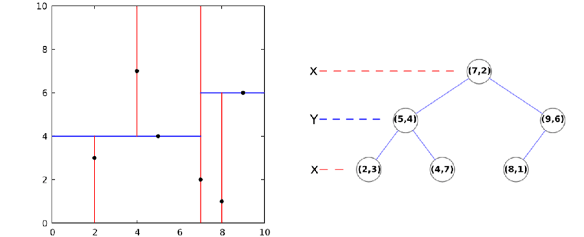
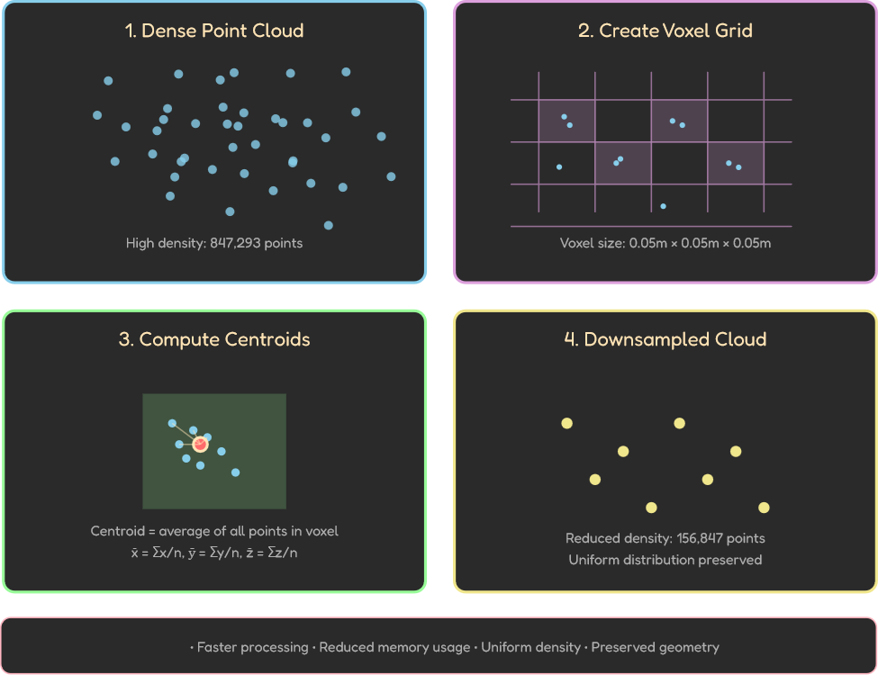

# LAB1: Kalman Filter / SLAM

## Table of Contents
- [LAB1: Kalman Filter / SLAM](#lab1-kalman-filter--slam)
  - [Table of Contents](#table-of-contents)
  - [Project Overview](#project-overview)
  - [System Architecture](#system-architecture)
  - [Setup](#setup)
    - [Dataset Description](#dataset-description)
    - [Running](#running)
  - [Part 1: EKF Odometry Fusion](#part-1-ekf-odometry-fusion)
    - [1.1 Wheel Odometry](#11-wheel-odometry)
      - [Robot Parameters](#robot-parameters)
      - [Wheel Displacement](#wheel-displacement)
      - [ICC (Instantaneous Center of Curvature) Kinematics](#icc-instantaneous-center-of-curvature-kinematics)
      - [Robot Velocity](#robot-velocity)
    - [1.2 Extended Kalman Filter](#12-extended-kalman-filter)
      - [1.2.1 State Vector Design](#121-state-vector-design)
      - [1.2.2 Motion Model (Prediction)](#122-motion-model-prediction)
      - [1.2.3 Measurement Model (Correction)](#123-measurement-model-correction)
      - [1.2.4 EKF Algorithm](#124-ekf-algorithm)
      - [1.2.5 Coordinate Frames](#125-coordinate-frames)
      - [1.2.6 Noise Covariance](#126-noise-covariance)
    - [1.3 Experimental Validation](#13-experimental-validation)
      - [Experimental Setup](#experimental-setup)
      - [Filter Validation](#filter-validation)
      - [Trajectory Comparison](#trajectory-comparison)
      - [Time Series Analysis](#time-series-analysis)
  - [Part 2: ICP Odometry Refinement](#part-2-icp-odometry-refinement)
    - [2.1 ICP Problem Formulation](#21-icp-problem-formulation)
    - [2.2 ICP Algorithm](#22-icp-algorithm)
    - [2.3 Nearest Neighbor Search for Correspondence](#23-nearest-neighbor-search-for-correspondence)
      - [Naive Approach: Linear Search](#naive-approach-linear-search)
      - [KD-Tree Optimization](#kd-tree-optimization)
    - [2.4 Point-to-Point ICP Implementation](#24-point-to-point-icp-implementation)
    - [2.5 ICP Odometry Pipeline](#25-icp-odometry-pipeline)
    - [2.6 Voxel Downsampling](#26-voxel-downsampling)
    - [2.7 Scan-to-Scan vs Scan-to-Map Matching](#27-scan-to-scan-vs-scan-to-map-matching)
    - [2.9 Experimental Results](#29-experimental-results)
      - [2.9.1 Method Comparison](#291-method-comparison)
      - [2.9.2 Sequence-Specific Results](#292-sequence-specific-results)
      - [2.9.3 Loop Closure Analysis](#293-loop-closure-analysis)
      - [2.9.4 Runtime Analysis](#294-runtime-analysis)
    - [2.10 ICP vs Wheel Odometry](#210-icp-vs-wheel-odometry)
  - [Part 3: Full SLAM with slam\_toolbox](#part-3-full-slam-with-slam_toolbox)
    - [3.1 What is slam\_toolbox?](#31-what-is-slam_toolbox)
    - [3.2 Available Launch Configurations](#32-available-launch-configurations)
    - [3.3 Mode Comparison: Synchronous vs Asynchronous](#33-mode-comparison-synchronous-vs-asynchronous)
    - [3.4 Configuration Parameters to Edit](#34-configuration-parameters-to-edit)
  - [Part 4: Results](#part-4-results)
  - [Part 5: Discussion](#part-5-discussion)
  - [Conclusion](#conclusion)

---

## Project Overview

<!-- TODO: Add project overview -->

---

## System Architecture

<!-- TODO: Add system architecture diagram -->

---

## Setup

```bash
# Clone the repository
git clone https://github.com/pboon09/FRA532-Autonomous-Mobile-Robot.git -b lab1

cd FRA532-Autonomous-Mobile-Robot

# Install dependencies
rosdep install --from-paths src --ignore-src -r -y

# Build
colcon build

# Source workspace
source install/setup.bash

# Add to bashrc (optional)
echo "source ~/FRA532-Autonomous-Mobile-Robot/install/setup.bash" >> ~/.bashrc
source ~/.bashrc
```

### Dataset Description
The dataset is provided as a ROS bag and contains sensor measurements recorded during robot motion.

**Topics included:**
- /scan: 2D LiDAR laser scans at 5 Hz
- /imu: Gyroscope and accelerometer data at 20 Hz
- /joint_states: Wheel motor position and velocity at 20 Hz

The dataset is divided into three sequences, each representing a different environmental condition:

1. **Sequence 00 – Empty Hallway:** A static indoor hallway environment with minimal obstacles and no dynamic objects. This sequence is intended to evaluate baseline odometry and sensor fusion performance.
2. **Sequence 01 – Non-Empty Hallway with Sharp Turns:** An indoor hallway environment containing obstacles and clutter, with sections of sharp turning motion. This sequence is designed to challenge odometry and scan matching performance under rapid heading changes.
3. **Sequence 02 – Non-Empty Hallway with Non-Aggressive Motion:** An indoor hallway environment with obstacles, similar to Sequence 2, but recorded with smoother and non-aggressive robot motion. This sequence is intended to evaluate performance under more stable motion conditions.

### Running

**Terminal 1: Play ROSBag**
```bash
cd FRA532-Autonomous-Mobile-Robot
 
# Sequence 00 - Empty Hallway
ros2 bag play FRA532_LAB1_DATASET/fibo_floor3_seq00 --clock

# Sequence 01 - Non-Empty Hallway with Sharp Turns
ros2 bag play FRA532_LAB1_DATASET/fibo_floor3_seq01 --clock

# Sequence 02 - Non-Empty Hallway with Non-Aggressive Motion
ros2 bag play FRA532_LAB1_DATASET/fibo_floor3_seq02 --clock
```

**Terminal 2: Choose which part you want to see the result**
```bash
ros2 launch turtle_bringup part1.launch.py

ros2 launch turtle_bringup part2.launch.py

ros2 launch turtle_bringup part3.launch.py
```

---

## Part 1: EKF Odometry Fusion

This section presents a sensor fusion approach combining wheel odometry and IMU orientation using an Extended Kalman Filter (EKF). The wheel odometry provides position and velocity estimates through encoder measurements, while the IMU supplies heading corrections to compensate for accumulated drift.

**References:**
- Columbia University CS4733 - [ICC Kinematics](https://www.cs.columbia.edu/~allen/F17/NOTES/icckinematics.pdf)

### 1.1 Wheel Odometry

#### Robot Parameters

| Parameter | Symbol | Value | Description |
|-----------|--------|-------|-------------|
| Wheel radius | r | 0.033 m | TurtleBot3 Burger wheel radius |
| Track width | b | 0.160 m | Distance between wheel centers |

#### Wheel Displacement

The wheel displacements are computed from encoder position changes:

```math
\Delta s_r = \Delta \theta_r \cdot r, \quad \Delta s_l = \Delta \theta_l \cdot r
```

where $\Delta \theta_r$ and $\Delta \theta_l$ represent the angular displacement of the right and left wheels in radians.

#### ICC (Instantaneous Center of Curvature) Kinematics

For differential drive robots, the ICC method provides accurate pose integration by computing the instantaneous turning center.

**Heading change:**

```math
\Delta \theta = \frac{\Delta s_r - \Delta s_l}{b}
```

**Turning radius:**

```math
R = \frac{b}{2} \cdot \frac{\Delta s_l + \Delta s_r}{\Delta s_r - \Delta s_l}
```

**ICC coordinates:**

```math
ICC_x = x - R \sin(\theta), \quad ICC_y = y + R \cos(\theta)
```

**Pose update (general case):**

```math
\begin{bmatrix} x' \\ y' \end{bmatrix} = \begin{bmatrix} \cos\Delta\theta & -\sin\Delta\theta \\ \sin\Delta\theta & \cos\Delta\theta \end{bmatrix} \begin{bmatrix} x - ICC_x \\ y - ICC_y \end{bmatrix} + \begin{bmatrix} ICC_x \\ ICC_y \end{bmatrix}
```

```math
\theta' = \theta + \Delta\theta
```

**Pose update (straight line, $|\Delta s_r - \Delta s_l| < \epsilon$):**

When the robot moves straight, $R \to \infty$. The pose update simplifies to:

```math
x' = x + \frac{\Delta s_l + \Delta s_r}{2} \cos\theta, \quad y' = y + \frac{\Delta s_l + \Delta s_r}{2} \sin\theta
```

#### Robot Velocity

The linear and angular velocities are derived from wheel displacements:

```math
v = \frac{\Delta s_r + \Delta s_l}{2 \Delta t}, \quad \omega = \frac{\Delta s_r - \Delta s_l}{b \cdot \Delta t}
```

**Position Delta vs Direct Velocity Measurement:**

The robot velocity is computed from **encoder position deltas** rather than the velocity field in JointState messages. This approach is preferred because encoder position is the **primary data source** from the hardware. The JointState velocity field is not used for two reasons: first, it **may be empty or unavailable** depending on the robot configuration; second, when present, the velocity is **already derived from position deltas**, so using it would add an unnecessary layer of indirection.

### 1.2 Extended Kalman Filter

#### 1.2.1 State Vector Design

The EKF estimates a 3-dimensional state vector:

```math
\mu = \begin{bmatrix} x \\ y \\ \theta \end{bmatrix}
```

| State | Description |
|-------|-------------|
| x | Position in x-axis (m) |
| y | Position in y-axis (m) |
| θ | Heading angle (rad) |

**Why these 3 states?**
- A ground robot is constrained to planar motion, so only 2D position and heading are needed
- Roll, pitch, and z-height are assumed constant (flat floor assumption)
- These states fully describe the robot's configuration in the odom frame

**Why not include velocities $(v, \omega)$?**

In this EKF formulation, velocities are treated as **control inputs**, not states:
- Wheel encoders directly measure $(v, \omega)$
- The EKF uses these as inputs to the motion model (prediction step)
- To estimate velocities as states, we would need **independent velocity measurements** for the correction step
- Since the IMU only provides heading $\theta$, there is no velocity measurement to fuse
- Including unmeasured states would only add uncertainty without improving the estimate

#### 1.2.2 Motion Model (Prediction)

**Control Input:**

```math
u_t = \begin{bmatrix} v \\ \omega \end{bmatrix}
```

**Why use $(v, \omega)$ instead of wheel odometry pose $(x, y, \theta)$?**

Using velocities allows the EKF to **perform its own integration**, maintaining a separate state that can be **corrected by IMU**. Using the integrated pose directly would **replace** the EKF state with wheel odometry, **bypassing fusion** entirely.

**State Transition (Unicycle Model):**

```math
\bar{\mu}_t = f(\mu_{t-1}, u_t) = \begin{bmatrix} x + v \cos\theta \cdot \Delta t \\ y + v \sin\theta \cdot \Delta t \\ \theta + \omega \cdot \Delta t \end{bmatrix}
```

**State Jacobian:**

```math
F_t = \frac{\partial f}{\partial \mu} = \begin{bmatrix} 1 & 0 & -v \sin\theta \cdot \Delta t \\ 0 & 1 & v \cos\theta \cdot \Delta t \\ 0 & 0 & 1 \end{bmatrix}
```

#### 1.2.3 Measurement Model (Correction)

**Measurement Vector:**

The IMU provides orientation as a quaternion. Only the yaw component is extracted:

```math
z_t = \begin{bmatrix} \theta_{IMU} \end{bmatrix}
```

**Why not use wheel odometry $(x, y, \theta)$ as measurements?**

Wheel odometry pose is derived from the **same encoder data** used in prediction. Using it as a measurement would **double-count** the same information. Measurements must come from **independent sensors**. The IMU provides heading independently of wheel encoders.

**IMU Data Selection:**

| IMU Data | Used | Rationale |
|----------|------|-----------|
| Orientation (yaw) | Yes | Heading reference independent of wheel slip |
| Orientation (roll, pitch) | No | Ground robot assumes planar motion |
| Angular velocity | No | Wheel encoders provide more accurate ω |
| Linear acceleration | No | Double integration causes drift; wheel odometry is superior |

**IMU Offset Handling:**

The IMU yaw is zeroed at startup by storing the initial reading as an offset. All subsequent measurements are relative to this initial heading, aligning the IMU frame with the odometry frame.

**Measurement Function:**

```math
h(\bar{\mu}_t) = \theta
```

**Measurement Jacobian:**

```math
H_t = \frac{\partial h}{\partial \mu} = \begin{bmatrix} 0 & 0 & 1 \end{bmatrix}
```

#### 1.2.4 EKF Algorithm

**Prediction Step:**

1. State prediction:
```math
\bar{\mu}_t = f(\mu_{t-1}, u_t)
```

2. Covariance prediction:
```math
\bar{\Sigma}_t = F_t \Sigma_{t-1} F_t^T + Q_t
```

**Correction Step:**

1. Innovation (Measurement Residual):
```math
y_t = z_t - h(\bar{\mu}_t)
```

2. Innovation covariance:
```math
S_t = H_t \bar{\Sigma}_t H_t^T + R_t
```

3. Kalman gain:
```math
K_t = \bar{\Sigma}_t H_t^T S_t^{-1}
```

4. State update:
```math
\mu_t = \bar{\mu}_t + K_t y_t
```

5. Covariance update:
```math
\Sigma_t = (I - K_t H_t) \bar{\Sigma}_t
```

**Angle Normalization:**

The heading angle $\theta$ is normalized to $[-\pi, \pi]$ after each update using:

```math
\theta = \text{atan2}(\sin\theta, \cos\theta)
```

#### 1.2.5 Coordinate Frames

**Frame Tree:**

```
odom (world-fixed, drifts over time)
  │
  └──► base_footprint (robot body frame)
          │
          └──► base_link, sensors, wheels...
```

The EKF publishes the `odom → base_footprint` transform because the estimate is based solely on wheel odometry and IMU, which accumulate drift over time. The `map` frame would imply global accuracy, which requires external localization (SLAM, GPS).

#### 1.2.6 Noise Covariance

**What is Process and Measurement Noise?**

The Kalman filter models two sources of uncertainty:

| Noise Type | Symbol | Source | Purpose |
|------------|--------|--------|---------|
| **Process Noise** | Q | Motion model imperfection | Accounts for unmodeled dynamics (wheel slip, terrain variation) |
| **Measurement Noise** | R | Sensor imperfection | Accounts for sensor noise and bias |

Without noise covariances, the filter cannot balance prediction vs. measurement. Q represents how much we **distrust** the motion model per timestep; R represents how much we **distrust** the sensor measurement.

**Covariance Matrices in This Work:**

```math
Q_t = \begin{bmatrix} Q_{xx} & 0 & 0 \\ 0 & Q_{yy} & 0 \\ 0 & 0 & Q_{\theta\theta} \end{bmatrix}, \quad R_t = \begin{bmatrix} R_{\theta\theta} \end{bmatrix}
```

**Trust Interpretation:**

| Value | Meaning |
|-------|---------|
| Lower Q | More trust in motion model (prediction) |
| Higher Q | Less trust in motion model, faster response to measurement |
| Lower R | More trust in measurement |
| Higher R | Less trust in measurement, smoother estimate, relies more on prediction |

**What Really Affects the Estimate in This 3-State Model?**

The IMU measures **only heading $\theta$**, which determines which states can be corrected.

**Why Only One Correction Source?**

- **Wheel odometry** $(v, \omega)$ drives the **prediction step** as control input
- **IMU** $\theta$ drives the **correction step** as measurement

Wheel odometry cannot be a measurement because it already defines the motion model. Using it for both would double-count information.

**What happens to $x$, $y$, $\theta$ during correction?**

Starting from the Kalman gain (Section 1.2.4):

```math
K_t = \bar{\Sigma}_t H_t^T (H_t \bar{\Sigma}_t H_t^T + R_t)^{-1}
```

With $H = [0, 0, 1]$:

```math
H_t \bar{\Sigma}_t H_t^T = \Sigma_{\theta\theta}, \quad \bar{\Sigma}_t H_t^T = \begin{bmatrix} \Sigma_{x\theta} \\ \Sigma_{y\theta} \\ \Sigma_{\theta\theta} \end{bmatrix}
```

```math
\therefore K_t = \begin{bmatrix} K_x \\ K_y \\ K_\theta \end{bmatrix} = \begin{bmatrix} \frac{\Sigma_{x\theta}}{\Sigma_{\theta\theta} + R_t} \\ \frac{\Sigma_{y\theta}}{\Sigma_{\theta\theta} + R_t} \\ \frac{\Sigma_{\theta\theta}}{\Sigma_{\theta\theta} + R_t} \end{bmatrix}
```

Since cross-covariances $\Sigma_{x\theta}, \Sigma_{y\theta} \approx 0$, we have $K_x \approx 0$ and $K_y \approx 0$.

**Key insight:** No matter what $Q_{xx}$, $Q_{yy}$ values we choose, x and y receive almost no correction because their Kalman gains are approximately zero.

**How do x and y change if no one corrects them?**

From the state update:

```math
\mu_t = \bar{\mu}_t + K_t y_t
```

With $K_x \approx 0$, $K_y \approx 0$:

```math
x_t \approx \bar{x}_t, \quad y_t \approx \bar{y}_t
```

Position states follow the **prediction exactly** (wheel odometry integration). The EKF does not correct position directly.

However, correcting $\theta$ **indirectly improves** position because future predictions use the corrected heading:

```math
\bar{x}_t = x_{t-1} + v \cos\theta_{t-1} \cdot \Delta t, \quad \bar{y}_t = y_{t-1} + v \sin\theta_{t-1} \cdot \Delta t
```

**What happens to $\theta$ when we change Q and R?**

From $K_\theta = \Sigma_{\theta\theta} / (\Sigma_{\theta\theta} + R)$ and the covariance prediction $\bar{\Sigma}_{\theta\theta} \approx \Sigma_{\theta\theta} + Q_{\theta\theta}$:

Increasing $Q_{\theta\theta}$ causes $\Sigma_{\theta\theta}$ to grow faster during prediction. A larger $\Sigma_{\theta\theta}$ in the numerator produces a larger $K_\theta$, which applies a stronger correction toward the IMU measurement.

Increasing $R$ adds more to the denominator $(\Sigma_{\theta\theta} + R)$, which produces a smaller $K_\theta$. A smaller gain means weaker correction and smoother estimates that rely more on prediction.

The ratio $Q_{\theta\theta}/R$ determines filter behavior; doubling both produces identical response.

**Conclusion**

With only IMU heading as correction source, only $Q_{\theta\theta}$ and $R$ affect the state estimate.

For $Q_{xx}$ and $Q_{yy}$, changing these values affects the covariance prediction:

```math
\bar{\Sigma}_{xx} = \Sigma_{xx,t-1} + Q_{xx}, \quad \bar{\Sigma}_{yy} = \Sigma_{yy,t-1} + Q_{yy}
```

However, these covariances do not appear in the Kalman gain $K$ because $H = [0, 0, 1]$ selects only $\Sigma_{\theta\theta}$. The state update $\mu = \bar{\mu} + K \cdot y$ remains unchanged regardless of $\Sigma_{xx}$ or $\Sigma_{yy}$. Therefore, tuning $Q_{xx}$ or $Q_{yy}$ only inflates the covariance matrix without changing the actual position estimates.

**Future Extension:** If position measurements were added (e.g., GPS), then $H$ would observe $x$ and $y$, making $K_x$ and $K_y$ non-zero. In that case, $Q_{xx}$ and $Q_{yy}$ would become meaningful tuning parameters.

### 1.3 Experimental Validation

<p align="center">
  
</p>


This section validates the EKF implementation using recorded bag files from a TurtleBot3 Burger navigating FIBO Floor 3 corridors.

#### Experimental Setup

**Dataset:**
| Sequence | Description | Duration | Samples |
|----------|-------------|----------|---------|
| seq00 | Empty hallway | 525s | 10,504 |
| seq01 | Non-empty hallway with sharp turns | 393s | 7,854 |
| seq02 | Non-empty hallway with non-aggressive motion | 599s | 11,975 |

**EKF Parameters:**
| Parameter | Value |
|-----------|-------|
| Q | diag(0.0, 0.0, 0.01) |
| R | 0.1 |
| Σ₀ | diag(0.0, 0.0, 0.1) |
| Wheel radius | 0.033 m |
| Track width | 0.160 m |

#### Filter Validation

We validate filter consistency using **innovation statistics** following [Bris & Kolarik (2014)](https://pmc.ncbi.nlm.nih.gov/articles/PMC4239867/):

> "The innovation sequence is zero-mean, white (uncorrelated), with covariance equal to the measurement prediction covariance."

**Innovation** (measurement residual):

```math
\nu_k = z_k - h(\bar{\mu}_k) = \theta_{IMU} - \theta_{predicted}
```

**Zero-Mean Test:**

For an unbiased filter, the null hypothesis is:

```math
H_0: \mathbb{E}[\nu] = 0
```

When accepted, this confirms "there is no significant discrepancy between a system estimate and a measurement model"

**What Innovation Statistics Tell Us**

| Metric | Expected | Interpretation |
|--------|----------|----------------|
| Mean ≈ 0 | $\mathbb{E}[\nu] = 0$ | Filter is **unbiased** |
| Small Std | Bounded variance | Filter is **not diverging** |

**Result**

| Sequence | Mean (°) | Std (°) |
|----------|----------|---------|
| seq00 | -0.001 | 0.113 |
| seq01 | -0.018 | 0.196 |
| seq02 | -0.003 | 0.119 |

Near-zero mean confirms the filter is unbiased. Small std confirms the filter is stable.

**Sequence 00:**


**Sequence 01:**


**Sequence 02:**


#### Trajectory Comparison

**Sequence 00:**


**Sequence 01:**


**Sequence 02:**


#### Time Series Analysis

**Sequence 00:**


**Sequence 01:**


**Sequence 02:**


---

## Part 2: ICP Odometry Refinement

This section presents scan-matching based odometry refinement using multiple variants of the Iterative Closest Point (ICP) algorithm. While EKF provides heading correction through IMU fusion, the position estimates still drift due to wheel slip and encoder noise. ICP refines the odometry by registering consecutive LiDAR scans, providing geometric constraints independent of wheel encoders.

**References:**
- Besl & McKay (1992) - [A Method for Registration of 3-D Shapes](https://graphics.stanford.edu/courses/cs164-09-spring/Handouts/paper_icp.pdf)
- Segal et al. (2009) - [Generalized-ICP](https://www.robots.ox.ac.uk/~avsegal/resources/papers/Generalized_ICP.pdf)
- Censi (2008) - [An ICP variant using a point-to-line metric](https://censi.science/pub/research/2008-icra-plicp.pdf)

### 2.1 ICP Problem Formulation

**Given** set of two sets of point cloud:

- $X = \{x_1, x_2, \ldots, x_n\}$
- $Y = \{y_1, y_2, \ldots, y_n\}$

**Objective:** Find the rotation $R$ and translation $t$ that minimize the sum of squared error between corresponding points:

```math
E(R, t) = \frac{1}{N_p} \sum_{i=1}^{N_p} \| x_i - Ry_i - t \|^2
```

where $x_i$ and $y_i$ are the corresponding points.

**For 2D LiDAR SLAM:**

The transformation is parameterized as:

```math
R = \begin{bmatrix} \cos\theta & -\sin\theta \\ \sin\theta & \cos\theta \end{bmatrix}, \quad t = \begin{bmatrix} t_x \\ t_y \end{bmatrix}
```

Optimization solves for $[t_x, t_y, \theta]$ to minimize the alignment error.

### 2.2 ICP Algorithm

The Iterative Closest Point algorithm solves the registration problem through an iterative two-step process. The basic algorithm follows this structure:

1. **Initialize:** Set $\bar{x}_n = x_n$ and error $e = \infty$
2. **While** ($e$ has decreased **and** $e >$ threshold):
   - **Correspondence Step:** $C = \text{match}(y_n, \bar{x}_n)$
     - Find nearest neighbors between source and target point clouds using KD-tree ($O(\log n)$ per query)
   - **Outlier Rejection:** $C' = \text{filter}(C)$
     - Distance threshold: Remove correspondences with $\|p_i - q_i\| > d_{max}$
     - Normal angle threshold: For Point-to-Plane and Point-to-Line, reject if $\cos^{-1}(n_1 \cdot n_2) > \theta_{max}$
   - **Transformation Step:** $(t, R) = \text{optimize}(C')$
     - Solve for optimal transformation that minimizes the error metric using inlier correspondences only
   - **Update:** $\bar{x}_n = R(x_n - x_0) + y_0$
     - Apply transformation to source points
   - **Compute Error:** $e = E(t, R)$
     - Evaluate alignment quality
3. **Return** $\{\bar{x}_n\}$

**Key Insight:** If correspondences were known a priori, a closed-form solution exists using Singular Value Decomposition (SVD). However, for LiDAR scan matching, correspondences are unknown. The algorithm iteratively alternates between estimating correspondences (nearest neighbor search) and estimating the transformation (least squares optimization) until convergence.

**Where do ICP variants differ?** The variants differ **only in the transformation step** - specifically in how the error metric $E(t, R)$ is defined and minimized.

### 2.3 Nearest Neighbor Search for Correspondence

The correspondence step finds matches between source and target point clouds. For each point $p_i$ in the source cloud, we must find its nearest neighbor $q_i$ in the target cloud.

#### Naive Approach: Linear Search

**Algorithm:**
```
For each point p_i in source cloud P:
    min_distance = ∞
    nearest_point = null

    For each point q_j in target cloud Q:
        distance = ||p_i - q_j||
        if distance < min_distance:
            min_distance = distance
            nearest_point = q_j

    correspondences[i] = (p_i, nearest_point)
```

**Complexity:** $O(n^2)$ - For $n$ source points and $n$ target points, requires $n \times n$ distance computations.

**Problem:** Too slow for Online SLAM

#### KD-Tree Optimization

**Data Structure:**

A KD-tree is a binary space-partitioning tree that recursively splits the point cloud along alternating axes:



*Source: [ResearchGate - Example of a 2D k-d tree](https://www.researchgate.net/figure/Example-of-a-2D-k-d-tree-Figure-reproduced-from-Wikipedia_fig29_284142470)*

**Algorithm:**
```
Construction O(n log n):
1. Choose splitting axis (x, then y, then x, ...)
2. Find median point along that axis
3. Partition points into left/right subtrees
4. Recursively build subtrees

Nearest Neighbor Query O(log n):
1. Start at root, traverse down tree based on query point coordinates
2. Find leaf node (initial candidate)
3. Backtrack and check other branches if necessary
4. Return closest point found
```

**Complexity:** $O(n \log n)$ for construction, $O(\log n)$ per query (average case)

**Advantage:** KD-tree reduces correspondence search from $O(n^2)$ to $O(n \log n)$, enabling real-time performance for Online SLAM. By partitioning space hierarchically, the tree eliminates large regions that cannot contain closer points, avoiding unnecessary distance computations.

**Implementation:** Open3D uses optimized KD-tree implementation with caching for repeated queries during ICP iterations.

### 2.4 Point-to-Point ICP Implementation

Point-to-Point ICP minimizes the Euclidean distance between corresponding points in the source and target clouds. Each point in the source cloud is matched to its nearest neighbor in the target cloud, and the transformation is optimized to reduce the sum of squared distances between all matched pairs.

**Distance Metric:**

```math
E_{P2P} = \sum_{i=1}^{N} \| T \cdot p_i - q_i \|^2
```

**Characteristics:**
- Simplest variant, minimizes Euclidean distance
- Fast convergence (~50 iterations max)
- Sensitive to outliers
- Works well for dense, overlapping scans

**Implementation:** Uses Open3D's `registration_icp()` with default point-to-point estimator.

**Transformation Step (SVD-based Procrustes):**

```
Input: Matched point pairs (P', Q) after correspondence
Output: Optimal rotation R and translation t

1. Compute centroids:
   centroid_P = mean(P')
   centroid_Q = mean(Q)

2. Center point clouds:
   P_centered = P' - centroid_P
   Q_centered = Q - centroid_Q

3. Compute cross-covariance matrix:
   H = P_centered^T · Q_centered

4. Solve for rotation using SVD:
   U, Σ, V^T = SVD(H)
   R = V · U^T

5. Solve for translation:
   t = centroid_Q - R · centroid_P

return (R, t)
```

### 2.5 ICP Odometry Pipeline

The ICP pipeline integrates scan matching with wheel odometry to refine pose estimates.

```
Input:  - Scan S_t at time t (point cloud in body frame)
        - Odometry estimate T_odom (from EKF)
        - Local map M (accumulated keyframes)

Output: - Refined pose T_refined
        - Fitness score (alignment quality)
        - Inlier RMSE (geometric error)
```

**Step 1: Scan Preprocessing:**

Remove invalid points outside sensor range:

```math
S_{filtered} = \{p \in S_t \mid r_{min} \leq \|p\| \leq r_{max}\}
```

Where $r_{min} = 0.1m$ and $r_{max} = 10m$.

Individual scans are kept at full resolution to preserve geometric detail for accurate correspondence matching.

**Step 2: Keyframe Selection:**

**Keyframe** is a selected robot pose with its corresponding scan that we store for later use in mapping. Not every scan becomes a keyframe. We need to determine if current scan should trigger ICP registration:

```math
\Delta d = \sqrt{(x_{current} - x_{kf})^2 + (y_{current} - y_{kf})^2}
```

```math
\Delta \theta = |angle(current) - angle(kf)|
```

If the robot moves more than threshold, we activate ICP. Otherwise, we use odometry only. This selective processing reduces computation while maintaining trajectory accuracy.

**Step 3: Local Map Construction:**

**What we have:**
- 1 new scan (current scan to be matched)
- n recent keyframes (stored from previous steps, n=15 in this implementation)

**What we do:**
```
M_{raw} = merge(keyframes[-n:])  # Combine all points from n scans into one point cloud
M = voxel_downsample(M_{raw}, voxel_size=0.05m)
```

**What we give to ICP (in Step 4):**
- **Source**: New scan (full resolution)
- **Target**: Local map M (downsampled)

**Step 4: ICP Registration:**

Run Point-to-Point ICP algorithm ([Section 2.4](#24-point-to-point-icp-implementation)) to find the transformation that best aligns the new scan with the local map using scan-to-map matching ([Section 2.7](#27-scan-to-scan-vs-scan-to-map-matching)):

```math
T_{icp} = \arg\min_T \sum_{i=1}^{N} \| T \cdot p_i - M \|^2
```

Where:
- $p_i$ = points in the new scan (source)
- $M$ = local map built from n recent keyframes (target)
- $\| T \cdot p_i - M \|^2$ = squared distance from $T \cdot p_i$ to its nearest neighbor in $M$
- $T_{init} = T_{odom}$ (initial guess from EKF)

The algorithm iteratively:
1. Finds correspondences: match each $T \cdot p_i$ to nearest point in $M$
2. Computes transformation: solve for $R, t$ using SVD ([Section 2.4](#24-point-to-point-icp-implementation))
3. Updates and repeats until convergence

Output quality metrics:
- Fitness: $f = N_{inliers} / N_{source}$ (percentage of successfully matched points)
- RMSE: $e = \sqrt{\frac{1}{N_{inliers}}\sum \|p_i - q_i\|^2}$ (average alignment error)

**Step 5: Rejection Gate:**

Validate ICP result to prevent catastrophic failures:

```math
\Delta_{correction} = \|T_{icp} - T_{odom}\|
```

If the correction is reasonable, we accept the ICP result. Otherwise, we reject it and use odometry instead. This prevents ICP from accepting wrong local minima convergence.

**Step 6: Update Trajectory:**

After getting the refined pose from Step 5, we do two things:

1. **Store the pose**: Save the refined pose with its timestamp to the trajectory history
2. **Update keyframe buffer**: Transform the current scan from body frame to global frame using the refined pose, then add it to the keyframe buffer for future local map construction

This completes one cycle of the ICP pipeline. The updated keyframe buffer will be used in Step 3 when the next keyframe is processed.

**System Integration:**

| Module | Input | Output | What It Corrects |
|--------|-------|--------|------------------|
| **Wheel Odometry** | Encoder deltas | Position, heading | Nothing (baseline, drifts) |
| **EKF (Part 1)** | Wheel velocity + IMU heading | Fused odometry | Heading θ only |
| **ICP (Part 2)** | EKF odometry + LiDAR scans | Refined trajectory | Position (x, y) + Heading θ |

> **Note:** This pipeline implements **graph construction (SLAM frontend)** only. It builds a keyframe-based trajectory through local scan matching but does not perform **graph optimization (SLAM backend)** such as pose graph optimization or loop closure detection. Without global optimization, accumulated drift is not corrected over long distances.


### 2.6 Voxel Downsampling

Before running ICP, raw LiDAR scans must be preprocessed to reduce computational cost while preserving geometric structure. Voxel downsampling achieves this by partitioning space into a regular grid and replacing all points within each voxel with their centroid.

> **Note:** While "voxel" technically refers to 3D volumetric cells, the term is conventionally used in both 2D and 3D SLAM systems for grid-based downsampling.

**Why Downsampling?**

Voxel downsampling reduces point cloud density while preserving geometric structure. This is useful when point clouds become too large for real-time processing.

**When to Apply:**

For 2D LiDAR SLAM, the decision depends on the point cloud size:

- **Individual scans**: One single LiDAR measurement at one moment in time. Use full resolution for high accuracy matching.
  - **Why keep full resolution?** Small size and need geometric detail for accurate ICP alignment. Downsampling would lose features like corners and edges.

- **Accumulated map**: Multiple scans merged together to form a larger point cloud. Downsample when combining multiple scans.
  - **Why downsample?** Large size becomes too slow for real-time ICP. Downsampling maintains structure while enabling fast matching.

This implementation keeps individual scans at full resolution (`voxel_size=0.0`) and only downsamples the local map (`voxel_size=0.05m`) to maintain real-time performance while preserving accuracy.

**Voxel Grid Method:**

```
Input: Point cloud P, Voxel size v
Output: Downsampled point cloud P_down

1. Create grid with cell size v:
   For each point p_i in P:
       voxel_index = floor(p_i / v)  # Map point to grid cell

2. Group points by voxel:
   voxel_map[voxel_index].append(p_i)

3. Compute centroid for each non-empty voxel:
   For each voxel in voxel_map:
       centroid = mean(voxel_map[voxel])
       P_down.append(centroid)

return P_down
```

**Visualization:**



*Source: [Smart 3D Change Detection - Medium](https://medium.com/data-science-collective/smart-3d-change-detection-python-tutorial-for-point-clouds-0dfd9945eb6a)*

**Key Properties:**

- **Uniform density**: Ensures evenly distributed points regardless of scanning pattern
- **Preserves structure**: Averaging preserves surface geometry and normals
- **Deterministic**: Same input always produces same output
- **Fast**: $O(n)$ complexity with hash-based voxel indexing

**Implementation:** Open3D's `voxel_down_sample()` uses optimized spatial hashing for $O(n)$ performance.

### 2.7 Scan-to-Scan vs Scan-to-Map Matching

ICP can be applied in two different registration strategies:

**Scan-to-Scan Matching:**

Align the current scan directly to the previous scan.

```math
T_t = \arg\min_{T} \sum_{i} \| T \cdot p_i^t - q_i^{t-1} \|^2
```

Where:
- $p_i^t$ = points in current scan at time $t$
- $q_i^{t-1}$ = points in previous scan at time $t-1$
- $T$ = transformation between consecutive scans

**Advantages:**
- Simple: only two point clouds involved
- Fast: minimal preprocessing required

**Disadvantages:**
- Less stable: single scan may have noise or occlusions
- Drift accumulation: errors compound over time
- Sensitive to rapid motion: low scan overlap causes failure

**Scan-to-Map Matching:**

Align the current scan to a local map built from recent keyframes.

```math
T_t = \arg\min_{T} \sum_{i} \| T \cdot p_i^t - M \|^2
```

Where:
- $p_i^t$ = points in current scan at time $t$
- $M$ = local map (accumulated from $N$ recent keyframes)
- $T$ = transformation from current scan to map frame

**Advantages:**
- More stable: map provides richer geometric constraints
- More robust: averaging multiple scans reduces noise
- Better convergence: more points increase basin of attraction

**Disadvantages:**
- Higher computational cost: map can contain 10,000+ points
- Requires map management: need to downsample and update map

**Why NOT Use Scan-to-Scan?**

Scan-to-scan matching is rarely used in practice because:
1. **Poor accuracy**: Single scans have noise and occlusions, leading to bad matches
2. **Drift accumulation**: Errors compound over time with no way to correct them
3. **Fails with fast motion**: Consecutive scans may not overlap enough
4. **Unstable**: Single scan provides weak geometric constraints for alignment

**Why Use Scan-to-Map?**

Scan-to-map matching is the standard approach in modern SLAM systems because:
1. **Better accuracy**: Map provides richer geometric information from multiple scans
2. **More stable**: Averaging multiple scans reduces noise and handles occlusions
3. **Robust to motion**: Map persists even when individual scans don't overlap
4. **Industry standard**: Used in Google Cartographer, slam_toolbox, and most production systems

**This Implementation:**

We use scan-to-map matching with local map management:
- Local map built from n recent keyframes
- Current scan kept at full resolution
- Local map downsampled for computational efficiency
- Provides balance between accuracy and real-time performance

### 2.9 Experimental Results

#### 2.9.1 Method Comparison

**Overall Performance:**

| Method | Avg Fitness | Avg RMSE (m) | Avg Runtime (ms) | Winner Count |
|--------|-------------|--------------|------------------|--------------|
| **Point-to-Point** | 0.974 | 0.041 | 5.0 | 0/3 |
| **Point-to-Plane** | 0.974 | 0.040 | 6.0 | 0/3 |
| **Point-to-Line** | **0.988** | **0.025** | **2.1** | 3/3 |
| **GICP** | 0.973 | 0.042 | 3.5 | 0/3 |

**Key Findings:**

1. **Point-to-Line** wins most sequences with:
   - Best fitness (0.988 avg)
   - Lowest RMSE (0.025m avg)
   - Fastest runtime (2.1ms avg)
   - **Optimal for 2D LiDAR SLAM**

2. **GICP** wins seq02 due to:
   - Probabilistic formulation handles non-aggressive motion
   - Covariance-based matching robust to partial overlaps

3. **Point-to-Point/Plane**:
   - Similar performance (designed for 3D)
   - Slower than Point-to-Line for 2D data

#### 2.9.2 Sequence-Specific Results

**Sequence 00:**
- **Winner**: Point-to-Line (score: 0.896)
- **Loop Closures**: 0 (open trajectory)
- **Best Fitness**: 0.990 (Point-to-Line)
- **Fastest**: 2.8ms (Point-to-Line)


**Sequence 01:**
- **Winner**: Point-to-Line (score: 0.884)
- **Loop Closures**: 0 (no revisits)
- **Best Fitness**: 0.988 (Point-to-Line)
- **Fastest**: 2.1ms (Point-to-Line)


**Sequence 02:**
- **Winner**: GICP (score: 0.911)
- **Loop Closures**: 128 (multiple revisits!)
- **Best Fitness**: 0.985 (Point-to-Line)
- **GICP Runtime**: 1.6ms (fastest this sequence)


#### 2.9.3 Loop Closure Analysis


**Loop Closure Summary:**

| Sequence | Best Method | Loops Detected | Fitness (Before) | Fitness (After) | RMSE (Before) | RMSE (After) |
|----------|-------------|----------------|------------------|-----------------|---------------|--------------|
| seq00 | GICP | 0 | 0.990 | - | 0.024m | - |
| seq01 | GICP | **14** | 0.975 | 0.975 | 0.074m | 0.074m |
| seq02 | GICP | **128** | 0.973 | 0.973 | 0.078m | 0.078m |

**Sequences with Loop Closures:**

When loops are detected, the system automatically:
1. Optimizes the trajectory using pose graph optimization
2. Re-evaluates ICP performance on the optimized trajectory
3. Generates performance comparison plots

**seq01 Loop Closure (14 loops):**


**seq02 Loop Closure (128 loops):**


**Loop Closure Impact:**

- **Trajectory Consistency**: Loop closure optimization distributes drift across the entire trajectory, creating globally consistent maps
- **Performance Stability**: Fitness and RMSE metrics remain stable after optimization
- **Computational Cost**: Levenberg-Marquardt optimization with 128 loop constraints completes in < 1 second
- **Information Weighting**: Loop edges weighted 10× odometry edges to prioritize global consistency

#### 2.9.4 Runtime Analysis


**Runtime Characteristics:**

- **Point-to-Line**: Fastest, most consistent (1.4-2.8ms)
- **GICP**: Fast but variable (1.6-4.9ms)
- **Point-to-Point**: Moderate (3.3-6.2ms)
- **Point-to-Plane**: Slowest (3.3-10.1ms)

All methods achieve **real-time performance** (< 100Hz LiDAR rate).

### 2.10 ICP vs Wheel Odometry

**Comparison with Part 1 (EKF-only):**

| Method | Position Drift | Heading Drift | Computational Cost |
|--------|---------------|---------------|-------------------|
| Wheel Odometry | High (unbounded) | Corrected by IMU | Minimal |
| EKF (Part 1) | High (x, y uncorrected) | Low (IMU fusion) | Low |
| **ICP (Part 2)** | **Low (geometric constraints)** | **Low (scan alignment)** | Moderate |

**Key Improvements:**

1. **Position Correction**: ICP provides independent geometric constraints for x, y
2. **Drift Reduction**: Scan matching limits accumulated error
3. **Loop Closure**: Enables global consistency in revisited areas

**When ICP Fails:**

- **Feature-poor environments**: Long empty hallways (no geometric structure)
- **High-speed motion**: Insufficient scan overlap
- **Dynamic objects**: Moving people cause registration errors

---

## Part 3: Full SLAM with slam_toolbox

This section demonstrates full 2D SLAM using the ROS2 slam_toolbox package, which provides production-grade mapping and localization capabilities with pose-graph optimization and loop closure detection.

### 3.1 What is slam_toolbox?

[slam_toolbox](https://github.com/SteveMacenski/slam_toolbox) is the officially supported SLAM library for ROS 2, developed by Steve Macenski. It combines LiDAR scan matching with odometry to build 2D maps using graph-based SLAM with the following key features:

**Core Capabilities:**
- **Graph-based SLAM:** Uses pose-graph optimization with scan matching based on the Karto SLAM algorithm
- **Loop Closure Detection:** Automatically detects when the robot revisits previously mapped areas and performs global optimization
- **Lifelong Mapping:** Supports serialization and deserialization of maps, allowing you to continue mapping sessions across different runs
- **Multiple Operation Modes:** Synchronous/asynchronous mapping, localization-only mode, and offline processing
- **Production-Ready Performance:** Benchmarked mapping buildings at 5x+ real-time up to 30,000 sq. ft.

**How It Works:**

1. **Input Processing:** Subscribes to `/scan` (LiDAR) and odometry transforms via `/tf`
2. **Scan Matching:** Aligns consecutive laser scans to refine odometry estimates
3. **Pose Graph Construction:** Builds a graph where nodes are robot poses and edges are spatial constraints from scan matching
4. **Loop Closure:** Detects revisited areas and adds loop closure constraints
5. **Graph Optimization:** Uses Ceres Solver with Levenberg-Marquardt to minimize pose-graph errors
6. **Map Generation:** Projects laser scans onto optimized poses to create occupancy grid maps

**References:**
- [slam_toolbox GitHub Repository](https://github.com/SteveMacenski/slam_toolbox)
- [ROS 2 Navigation with SLAM Tutorial](https://docs.nav2.org/tutorials/docs/navigation2_with_slam.html)
- [slam_toolbox Documentation](https://docs.ros.org/en/ros2_packages/humble/api/slam_toolbox/)

### 3.2 Available Launch Configurations

slam_toolbox provides **6 different launch files**, each optimized for specific use cases:

| Launch File | Mode | Use Case | Processing |
|-------------|------|----------|------------|
| **online_sync_launch.py** | Synchronous Mapping | Real-time mapping with guaranteed processing of every scan | Blocks until each scan is processed |
| **online_async_launch.py** | Asynchronous Mapping | Real-time mapping with best-effort processing (recommended for live robots) | Drops scans if processing lags |
| **lifelong_launch.py** | Lifelong Mapping | Continue mapping from previously saved session, with old data removal | Updates existing pose-graph |
| **localization_launch.py** | Localization Only | AMCL-alternative using pose-graph optimization (no new mapping) | Uses pre-built map |
| **offline_launch.py** | Offline Processing | Process pre-recorded bag files to generate maps | Batch processing |
| **merge_maps_kinematic_launch.py** | Map Merging | Combine multiple serialized maps into one global map | Offline merging |

### 3.3 Mode Comparison: Synchronous vs Asynchronous

The two most common modes for live mapping are **online_sync** and **online_async**. Understanding their differences is critical for choosing the right configuration:

| Feature | Online Synchronous | Online Asynchronous |
|---------|-------------------|---------------------|
| **Scan Processing** | Processes **every** scan sequentially | Drops scans if processing can't keep up |
| **Real-time Guarantee** | No (may lag if computation is slow) | Yes (always maintains real-time) |
| **Map Quality** | Higher (uses all data) | Good (slight information loss) |
| **CPU Usage** | Can spike during loop closures | More consistent and bounded |
| **Best For** | Offline processing, small areas, powerful computers | Live robots, large areas, embedded systems |
| **When to Use** | When you need maximum accuracy and can tolerate lag | When real-time performance is critical |


### 3.4 Configuration Parameters to Edit

slam_toolbox behavior is controlled through YAML configuration files located in:
```
src/slam_toolbox/config/
```

**Key Configuration Files:**
- `mapper_params_online_async.yaml` - For asynchronous mapping
- `mapper_params_online_sync.yaml` - For synchronous mapping
- `mapper_params_lifelong.yaml` - For lifelong mapping
- `mapper_params_localization.yaml` - For localization-only mode

**Critical Parameters to Adjust:**

| Parameter | Default | Description | When to Change |
|-----------|---------|-------------|----------------|
| **scan_topic** | `/scan` | LiDAR topic to subscribe to | If your LiDAR publishes to a different topic |
| **odom_frame** | `odom` | Odometry frame name | Must match your EKF output frame |
| **base_frame** | `base_footprint` | Robot base frame | Must match your robot's URDF |
| **map_frame** | `map` | Global map frame | Usually keep as `map` |
| **resolution** | `0.05` | Map resolution (m/pixel) | Higher (0.1) for faster processing, lower (0.025) for detail |
| **min_laser_range** | `0.12` | Minimum valid range (m) | Match your LiDAR specs |
| **max_laser_range** | `3.5` | Maximum valid range (m) | Reduce for indoor, increase for outdoor |
| **minimum_travel_distance** | `0.5` | Distance (m) before adding new scan | Lower (0.2) for detailed maps, higher (1.0) for speed |
| **minimum_travel_heading** | `0.5` | Rotation (rad) before adding new scan | Lower (0.2) for curves, higher (1.0) for straight paths |
| **do_loop_closing** | `true` | Enable loop closure detection | Set `false` if causing issues |
| **loop_search_maximum_distance** | `3.0` | Max distance (m) to search for loops | Increase for large loops |

---

## Part 4: Results

<!-- TODO: Add trajectory plots and maps -->

---

## Part 5: Discussion

<!-- TODO: Add comparison and analysis -->

---

## Conclusion

<!-- TODO: Add conclusion -->
