# LAB1: Kalman Filter / SLAM

## Table of Contents
- [LAB1: Kalman Filter / SLAM](#lab1-kalman-filter--slam)
  - [Table of Contents](#table-of-contents)
  - [Project Overview](#project-overview)
  - [System Architecture](#system-architecture)
  - [Setup](#setup)
    - [Running](#running)
  - [Part 1: EKF Odometry Fusion](#part-1-ekf-odometry-fusion)
    - [1.1 Wheel Odometry](#11-wheel-odometry)
      - [Robot Parameters](#robot-parameters)
      - [Wheel Displacement](#wheel-displacement)
      - [ICC (Instantaneous Center of Curvature) Kinematics](#icc-instantaneous-center-of-curvature-kinematics)
      - [Robot Velocity](#robot-velocity)
    - [1.2 Extended Kalman Filter](#12-extended-kalman-filter)
      - [1.2.1 State Vector Design](#121-state-vector-design)
      - [1.2.2 Motion Model (Prediction)](#122-motion-model-prediction)
      - [1.2.3 Measurement Model (Correction)](#123-measurement-model-correction)
      - [1.2.4 EKF Algorithm](#124-ekf-algorithm)
      - [1.2.5 Coordinate Frames](#125-coordinate-frames)
      - [1.2.6 Noise Covariance](#126-noise-covariance)
    - [1.3 Experimental Validation](#13-experimental-validation)
      - [Experimental Setup](#experimental-setup)
      - [Filter Validation](#filter-validation)
      - [Trajectory Comparison](#trajectory-comparison)
      - [Time Series Analysis](#time-series-analysis)
  - [Part 2: ICP Odometry Refinement](#part-2-icp-odometry-refinement)
    - [2.1 ICP Problem Formulation](#21-icp-problem-formulation)
    - [2.2 ICP Variants](#22-icp-variants)
      - [2.2.1 Point-to-Point ICP](#221-point-to-point-icp)
      - [2.2.2 Point-to-Plane ICP](#222-point-to-plane-icp)
      - [2.2.3 Point-to-Line ICP (PLICP)](#223-point-to-line-icp-plicp)
      - [2.2.4 Generalized ICP (GICP)](#224-generalized-icp-gicp)
    - [2.3 ICP Pipeline](#23-icp-pipeline)
    - [2.4 Loop Closure Detection](#24-loop-closure-detection)
      - [2.4.1 Loop Detection Strategy](#241-loop-detection-strategy)
      - [2.4.2 Pose Graph Optimization](#242-pose-graph-optimization)
    - [2.5 Method Ranking](#25-method-ranking)
    - [2.6 Experimental Results](#26-experimental-results)
      - [2.6.1 Method Comparison](#261-method-comparison)
      - [2.6.2 Sequence-Specific Results](#262-sequence-specific-results)
      - [2.6.3 Loop Closure Analysis](#263-loop-closure-analysis)
      - [2.6.4 Runtime Analysis](#264-runtime-analysis)
    - [2.7 ICP vs Wheel Odometry](#27-icp-vs-wheel-odometry)
    - [2.8 Conclusion](#28-conclusion)
  - [Part 3: Full SLAM with slam\_toolbox](#part-3-full-slam-with-slam_toolbox)
  - [Part 4: Results](#part-4-results)
  - [Part 5: Discussion](#part-5-discussion)
  - [Conclusion](#conclusion)

---

## Project Overview

<!-- TODO: Add project overview -->

---

## System Architecture

<!-- TODO: Add system architecture diagram -->

---

## Setup

```bash
# Clone the repository
git clone https://github.com/pboon09/FRA532-Autonomous-Mobile-Robot.git -b lab1

cd FRA532-Autonomous-Mobile-Robot

# Install dependencies
rosdep install --from-paths src --ignore-src -r -y

# Build
colcon build

# Source workspace
source install/setup.bash

# Add to bashrc (optional)
echo "source ~/FRA532-Autonomous-Mobile-Robot/install/setup.bash" >> ~/.bashrc
source ~/.bashrc
```

### Running

**Terminal 1: Play ROSBag**
```bash
cd FRA532-Autonomous-Mobile-Robot
 
# Sequence 00 - Empty Hallway
ros2 bag play FRA532_LAB1_DATASET/fibo_floor3_seq00 --clock

# Sequence 01 - Non-Empty Hallway with Sharp Turns
ros2 bag play FRA532_LAB1_DATASET/fibo_floor3_seq01 --clock

# Sequence 02 - Non-Empty Hallway with Non-Aggressive Motion
ros2 bag play FRA532_LAB1_DATASET/fibo_floor3_seq02 --clock
```

**Terminal 2: Choose which part you want to see the result**
```bash
ros2 launch turtle_bringup part1.launch.py
```

---

## Part 1: EKF Odometry Fusion

This section presents a sensor fusion approach combining wheel odometry and IMU orientation using an Extended Kalman Filter (EKF). The wheel odometry provides position and velocity estimates through encoder measurements, while the IMU supplies heading corrections to compensate for accumulated drift.

**References:**
- Columbia University CS4733 - [ICC Kinematics](https://www.cs.columbia.edu/~allen/F17/NOTES/icckinematics.pdf)

### 1.1 Wheel Odometry

#### Robot Parameters

| Parameter | Symbol | Value | Description |
|-----------|--------|-------|-------------|
| Wheel radius | r | 0.033 m | TurtleBot3 Burger wheel radius |
| Track width | b | 0.160 m | Distance between wheel centers |

#### Wheel Displacement

The wheel displacements are computed from encoder position changes:

```math
\Delta s_r = \Delta \theta_r \cdot r, \quad \Delta s_l = \Delta \theta_l \cdot r
```

where $\Delta \theta_r$ and $\Delta \theta_l$ represent the angular displacement of the right and left wheels in radians.

#### ICC (Instantaneous Center of Curvature) Kinematics

For differential drive robots, the ICC method provides accurate pose integration by computing the instantaneous turning center.

**Heading change:**

```math
\Delta \theta = \frac{\Delta s_r - \Delta s_l}{b}
```

**Turning radius:**

```math
R = \frac{b}{2} \cdot \frac{\Delta s_l + \Delta s_r}{\Delta s_r - \Delta s_l}
```

**ICC coordinates:**

```math
ICC_x = x - R \sin(\theta), \quad ICC_y = y + R \cos(\theta)
```

**Pose update (general case):**

```math
\begin{bmatrix} x' \\ y' \end{bmatrix} = \begin{bmatrix} \cos\Delta\theta & -\sin\Delta\theta \\ \sin\Delta\theta & \cos\Delta\theta \end{bmatrix} \begin{bmatrix} x - ICC_x \\ y - ICC_y \end{bmatrix} + \begin{bmatrix} ICC_x \\ ICC_y \end{bmatrix}
```

```math
\theta' = \theta + \Delta\theta
```

**Pose update (straight line, $|\Delta s_r - \Delta s_l| < \epsilon$):**

When the robot moves straight, $R \to \infty$. The pose update simplifies to:

```math
x' = x + \frac{\Delta s_l + \Delta s_r}{2} \cos\theta, \quad y' = y + \frac{\Delta s_l + \Delta s_r}{2} \sin\theta
```

#### Robot Velocity

The linear and angular velocities are derived from wheel displacements:

```math
v = \frac{\Delta s_r + \Delta s_l}{2 \Delta t}, \quad \omega = \frac{\Delta s_r - \Delta s_l}{b \cdot \Delta t}
```

**Position Delta vs Direct Velocity Measurement:**

The robot velocity is computed from **encoder position deltas** rather than the velocity field in JointState messages. This approach is preferred because encoder position is the **primary data source** from the hardware. The JointState velocity field is not used for two reasons: first, it **may be empty or unavailable** depending on the robot configuration; second, when present, the velocity is **already derived from position deltas**, so using it would add an unnecessary layer of indirection.

### 1.2 Extended Kalman Filter

#### 1.2.1 State Vector Design

The EKF estimates a 3-dimensional state vector:

```math
\mu = \begin{bmatrix} x \\ y \\ \theta \end{bmatrix}
```

| State | Description |
|-------|-------------|
| x | Position in x-axis (m) |
| y | Position in y-axis (m) |
| θ | Heading angle (rad) |

**Why these 3 states?**
- A ground robot is constrained to planar motion, so only 2D position and heading are needed
- Roll, pitch, and z-height are assumed constant (flat floor assumption)
- These states fully describe the robot's configuration in the odom frame

**Why not include velocities $(v, \omega)$?**

In this EKF formulation, velocities are treated as **control inputs**, not states:
- Wheel encoders directly measure $(v, \omega)$
- The EKF uses these as inputs to the motion model (prediction step)
- To estimate velocities as states, we would need **independent velocity measurements** for the correction step
- Since the IMU only provides heading $\theta$, there is no velocity measurement to fuse
- Including unmeasured states would only add uncertainty without improving the estimate

#### 1.2.2 Motion Model (Prediction)

**Control Input:**

```math
u_t = \begin{bmatrix} v \\ \omega \end{bmatrix}
```

**Why use $(v, \omega)$ instead of wheel odometry pose $(x, y, \theta)$?**

Using velocities allows the EKF to **perform its own integration**, maintaining a separate state that can be **corrected by IMU**. Using the integrated pose directly would **replace** the EKF state with wheel odometry, **bypassing fusion** entirely.

**State Transition (Unicycle Model):**

```math
\bar{\mu}_t = f(\mu_{t-1}, u_t) = \begin{bmatrix} x + v \cos\theta \cdot \Delta t \\ y + v \sin\theta \cdot \Delta t \\ \theta + \omega \cdot \Delta t \end{bmatrix}
```

**State Jacobian:**

```math
F_t = \frac{\partial f}{\partial \mu} = \begin{bmatrix} 1 & 0 & -v \sin\theta \cdot \Delta t \\ 0 & 1 & v \cos\theta \cdot \Delta t \\ 0 & 0 & 1 \end{bmatrix}
```

#### 1.2.3 Measurement Model (Correction)

**Measurement Vector:**

The IMU provides orientation as a quaternion. Only the yaw component is extracted:

```math
z_t = \begin{bmatrix} \theta_{IMU} \end{bmatrix}
```

**Why not use wheel odometry $(x, y, \theta)$ as measurements?**

Wheel odometry pose is derived from the **same encoder data** used in prediction. Using it as a measurement would **double-count** the same information. Measurements must come from **independent sensors**. The IMU provides heading independently of wheel encoders.

**IMU Data Selection:**

| IMU Data | Used | Rationale |
|----------|------|-----------|
| Orientation (yaw) | Yes | Heading reference independent of wheel slip |
| Orientation (roll, pitch) | No | Ground robot assumes planar motion |
| Angular velocity | No | Wheel encoders provide more accurate ω |
| Linear acceleration | No | Double integration causes drift; wheel odometry is superior |

**IMU Offset Handling:**

The IMU yaw is zeroed at startup by storing the initial reading as an offset. All subsequent measurements are relative to this initial heading, aligning the IMU frame with the odometry frame.

**Measurement Function:**

```math
h(\bar{\mu}_t) = \theta
```

**Measurement Jacobian:**

```math
H_t = \frac{\partial h}{\partial \mu} = \begin{bmatrix} 0 & 0 & 1 \end{bmatrix}
```

#### 1.2.4 EKF Algorithm

**Prediction Step:**

1. State prediction:
```math
\bar{\mu}_t = f(\mu_{t-1}, u_t)
```

2. Covariance prediction:
```math
\bar{\Sigma}_t = F_t \Sigma_{t-1} F_t^T + Q_t
```

**Correction Step:**

1. Innovation (Measurement Residual):
```math
y_t = z_t - h(\bar{\mu}_t)
```

2. Innovation covariance:
```math
S_t = H_t \bar{\Sigma}_t H_t^T + R_t
```

3. Kalman gain:
```math
K_t = \bar{\Sigma}_t H_t^T S_t^{-1}
```

4. State update:
```math
\mu_t = \bar{\mu}_t + K_t y_t
```

5. Covariance update:
```math
\Sigma_t = (I - K_t H_t) \bar{\Sigma}_t
```

**Angle Normalization:**

The heading angle $\theta$ is normalized to $[-\pi, \pi]$ after each update using:

```math
\theta = \text{atan2}(\sin\theta, \cos\theta)
```

#### 1.2.5 Coordinate Frames

**Frame Tree:**

```
odom (world-fixed, drifts over time)
  │
  └──► base_footprint (robot body frame)
          │
          └──► base_link, sensors, wheels...
```

The EKF publishes the `odom → base_footprint` transform because the estimate is based solely on wheel odometry and IMU, which accumulate drift over time. The `map` frame would imply global accuracy, which requires external localization (SLAM, GPS).

#### 1.2.6 Noise Covariance

**What is Process and Measurement Noise?**

The Kalman filter models two sources of uncertainty:

| Noise Type | Symbol | Source | Purpose |
|------------|--------|--------|---------|
| **Process Noise** | Q | Motion model imperfection | Accounts for unmodeled dynamics (wheel slip, terrain variation) |
| **Measurement Noise** | R | Sensor imperfection | Accounts for sensor noise and bias |

Without noise covariances, the filter cannot balance prediction vs. measurement. Q represents how much we **distrust** the motion model per timestep; R represents how much we **distrust** the sensor measurement.

**Covariance Matrices in This Work:**

```math
Q_t = \begin{bmatrix} Q_{xx} & 0 & 0 \\ 0 & Q_{yy} & 0 \\ 0 & 0 & Q_{\theta\theta} \end{bmatrix}, \quad R_t = \begin{bmatrix} R_{\theta\theta} \end{bmatrix}
```

**Trust Interpretation:**

| Value | Meaning |
|-------|---------|
| Lower Q | More trust in motion model (prediction) |
| Higher Q | Less trust in motion model, faster response to measurement |
| Lower R | More trust in measurement |
| Higher R | Less trust in measurement, smoother estimate, relies more on prediction |

**What Really Affects the Estimate in This 3-State Model?**

The IMU measures **only heading $\theta$**, which determines which states can be corrected.

**Why Only One Correction Source?**

- **Wheel odometry** $(v, \omega)$ drives the **prediction step** as control input
- **IMU** $\theta$ drives the **correction step** as measurement

Wheel odometry cannot be a measurement because it already defines the motion model. Using it for both would double-count information.

**What happens to $x$, $y$, $\theta$ during correction?**

Starting from the Kalman gain (Section 1.2.4):

```math
K_t = \bar{\Sigma}_t H_t^T (H_t \bar{\Sigma}_t H_t^T + R_t)^{-1}
```

With $H = [0, 0, 1]$:

```math
H_t \bar{\Sigma}_t H_t^T = \Sigma_{\theta\theta}, \quad \bar{\Sigma}_t H_t^T = \begin{bmatrix} \Sigma_{x\theta} \\ \Sigma_{y\theta} \\ \Sigma_{\theta\theta} \end{bmatrix}
```

```math
\therefore K_t = \begin{bmatrix} K_x \\ K_y \\ K_\theta \end{bmatrix} = \begin{bmatrix} \frac{\Sigma_{x\theta}}{\Sigma_{\theta\theta} + R_t} \\ \frac{\Sigma_{y\theta}}{\Sigma_{\theta\theta} + R_t} \\ \frac{\Sigma_{\theta\theta}}{\Sigma_{\theta\theta} + R_t} \end{bmatrix}
```

Since cross-covariances $\Sigma_{x\theta}, \Sigma_{y\theta} \approx 0$, we have $K_x \approx 0$ and $K_y \approx 0$.

**Key insight:** No matter what $Q_{xx}$, $Q_{yy}$ values we choose, x and y receive almost no correction because their Kalman gains are approximately zero.

**How do x and y change if no one corrects them?**

From the state update:

```math
\mu_t = \bar{\mu}_t + K_t y_t
```

With $K_x \approx 0$, $K_y \approx 0$:

```math
x_t \approx \bar{x}_t, \quad y_t \approx \bar{y}_t
```

Position states follow the **prediction exactly** (wheel odometry integration). The EKF does not correct position directly.

However, correcting $\theta$ **indirectly improves** position because future predictions use the corrected heading:

```math
\bar{x}_t = x_{t-1} + v \cos\theta_{t-1} \cdot \Delta t, \quad \bar{y}_t = y_{t-1} + v \sin\theta_{t-1} \cdot \Delta t
```

**What happens to $\theta$ when we change Q and R?**

From $K_\theta = \Sigma_{\theta\theta} / (\Sigma_{\theta\theta} + R)$ and the covariance prediction $\bar{\Sigma}_{\theta\theta} \approx \Sigma_{\theta\theta} + Q_{\theta\theta}$:

Increasing $Q_{\theta\theta}$ causes $\Sigma_{\theta\theta}$ to grow faster during prediction. A larger $\Sigma_{\theta\theta}$ in the numerator produces a larger $K_\theta$, which applies a stronger correction toward the IMU measurement.

Increasing $R$ adds more to the denominator $(\Sigma_{\theta\theta} + R)$, which produces a smaller $K_\theta$. A smaller gain means weaker correction and smoother estimates that rely more on prediction.

The ratio $Q_{\theta\theta}/R$ determines filter behavior; doubling both produces identical response.

**Conclusion**

With only IMU heading as correction source, only $Q_{\theta\theta}$ and $R$ affect the state estimate.

For $Q_{xx}$ and $Q_{yy}$, changing these values affects the covariance prediction:

```math
\bar{\Sigma}_{xx} = \Sigma_{xx,t-1} + Q_{xx}, \quad \bar{\Sigma}_{yy} = \Sigma_{yy,t-1} + Q_{yy}
```

However, these covariances do not appear in the Kalman gain $K$ because $H = [0, 0, 1]$ selects only $\Sigma_{\theta\theta}$. The state update $\mu = \bar{\mu} + K \cdot y$ remains unchanged regardless of $\Sigma_{xx}$ or $\Sigma_{yy}$. Therefore, tuning $Q_{xx}$ or $Q_{yy}$ only inflates the covariance matrix without changing the actual position estimates.

**Future Extension:** If position measurements were added (e.g., GPS), then $H$ would observe $x$ and $y$, making $K_x$ and $K_y$ non-zero. In that case, $Q_{xx}$ and $Q_{yy}$ would become meaningful tuning parameters.

### 1.3 Experimental Validation

<p align="center">
  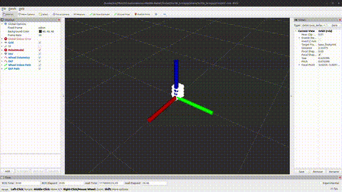
</p>


This section validates the EKF implementation using recorded bag files from a TurtleBot3 Burger navigating FIBO Floor 3 corridors.

#### Experimental Setup

**Dataset:**
| Sequence | Description | Duration | Samples |
|----------|-------------|----------|---------|
| seq00 | Empty hallway | 525s | 10,504 |
| seq01 | Non-empty hallway with sharp turns | 393s | 7,854 |
| seq02 | Non-empty hallway with non-aggressive motion | 599s | 11,975 |

**EKF Parameters:**
| Parameter | Value |
|-----------|-------|
| Q | diag(0.0, 0.0, 0.01) |
| R | 0.1 |
| Σ₀ | diag(0.0, 0.0, 0.1) |
| Wheel radius | 0.033 m |
| Track width | 0.160 m |

#### Filter Validation

We validate filter consistency using **innovation statistics** following [Bris & Kolarik (2014)](https://pmc.ncbi.nlm.nih.gov/articles/PMC4239867/):

> "The innovation sequence is zero-mean, white (uncorrelated), with covariance equal to the measurement prediction covariance."

**Innovation** (measurement residual):

```math
\nu_k = z_k - h(\bar{\mu}_k) = \theta_{IMU} - \theta_{predicted}
```

**Zero-Mean Test:**

For an unbiased filter, the null hypothesis is:

```math
H_0: \mathbb{E}[\nu] = 0
```

When accepted, this confirms "there is no significant discrepancy between a system estimate and a measurement model"

**What Innovation Statistics Tell Us**

| Metric | Expected | Interpretation |
|--------|----------|----------------|
| Mean ≈ 0 | $\mathbb{E}[\nu] = 0$ | Filter is **unbiased** |
| Small Std | Bounded variance | Filter is **not diverging** |

**Result**

| Sequence | Mean (°) | Std (°) |
|----------|----------|---------|
| seq00 | -0.001 | 0.113 |
| seq01 | -0.018 | 0.196 |
| seq02 | -0.003 | 0.119 |

Near-zero mean confirms the filter is unbiased. Small std confirms the filter is stable.

**Sequence 00:**

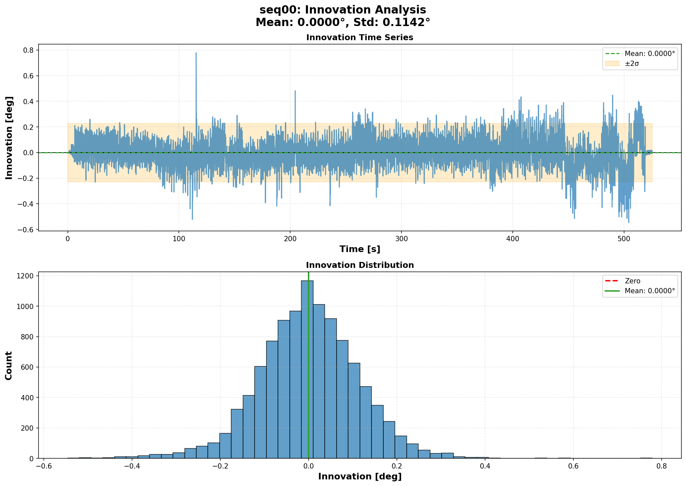

**Sequence 01:**

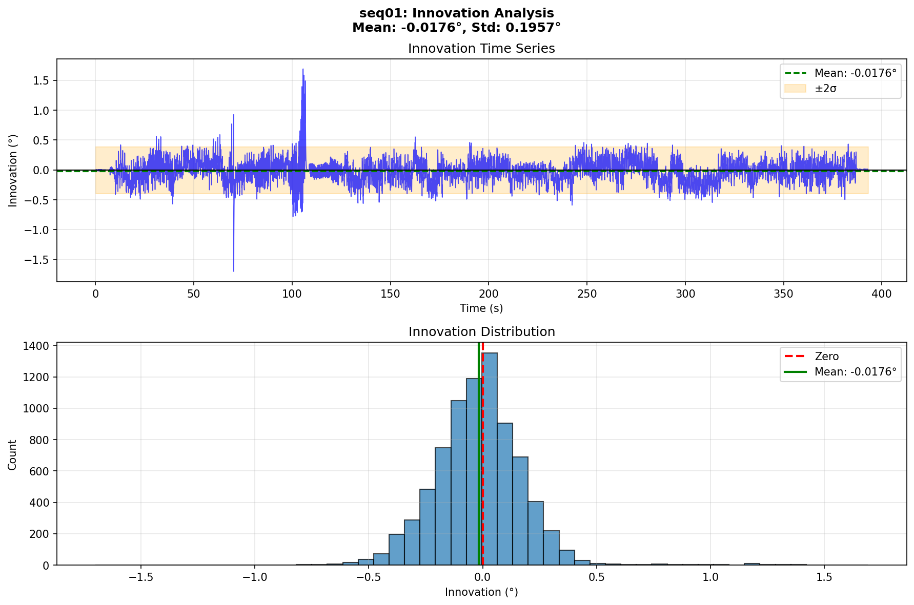

**Sequence 02:**

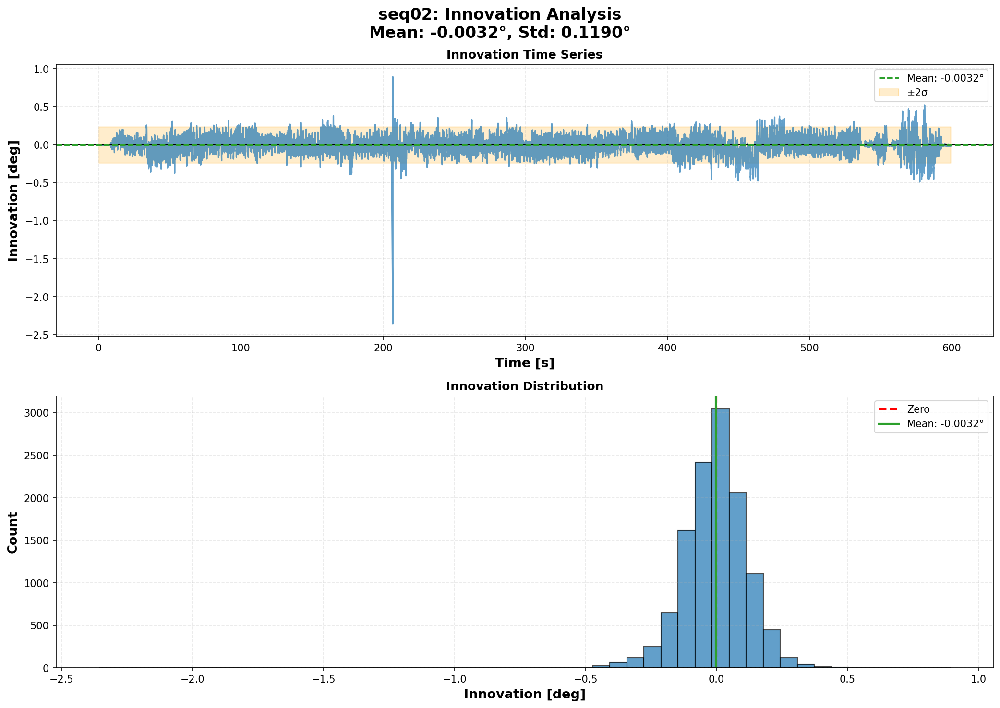

#### Trajectory Comparison

**Sequence 00:**

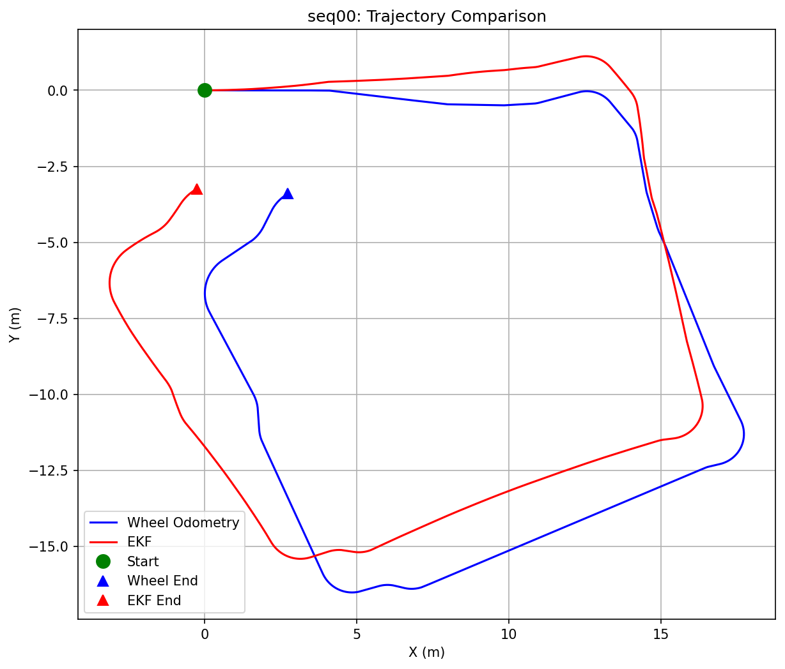

**Sequence 01:**

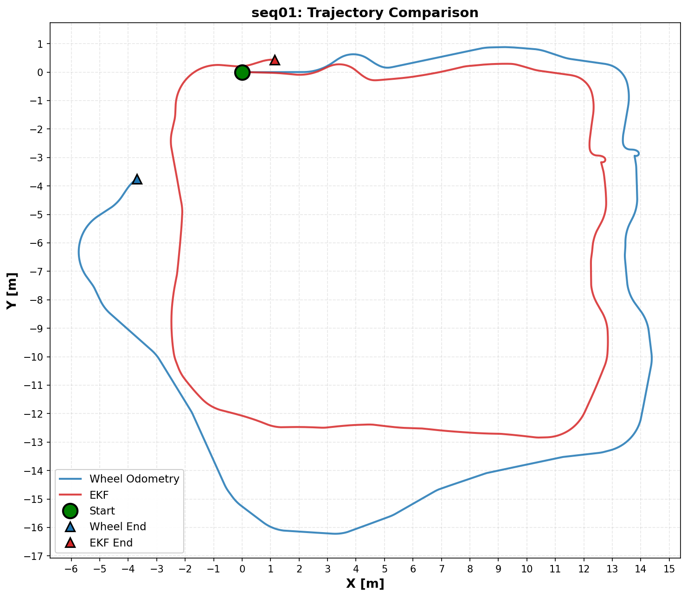

**Sequence 02:**

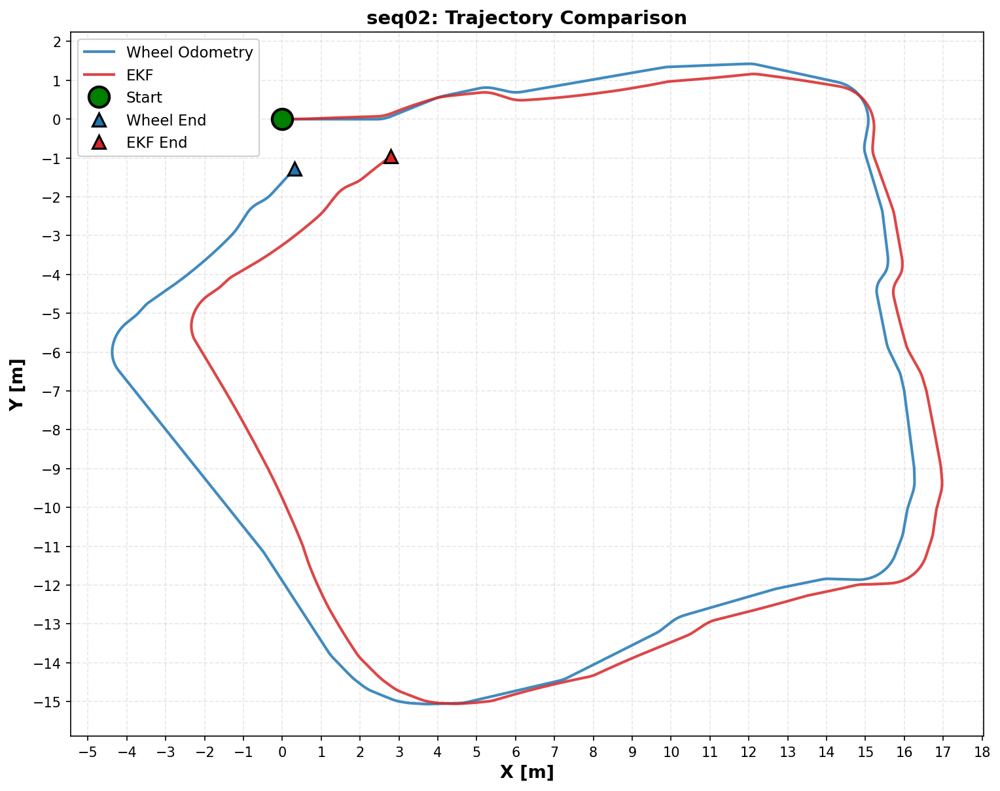

#### Time Series Analysis

**Sequence 00:**

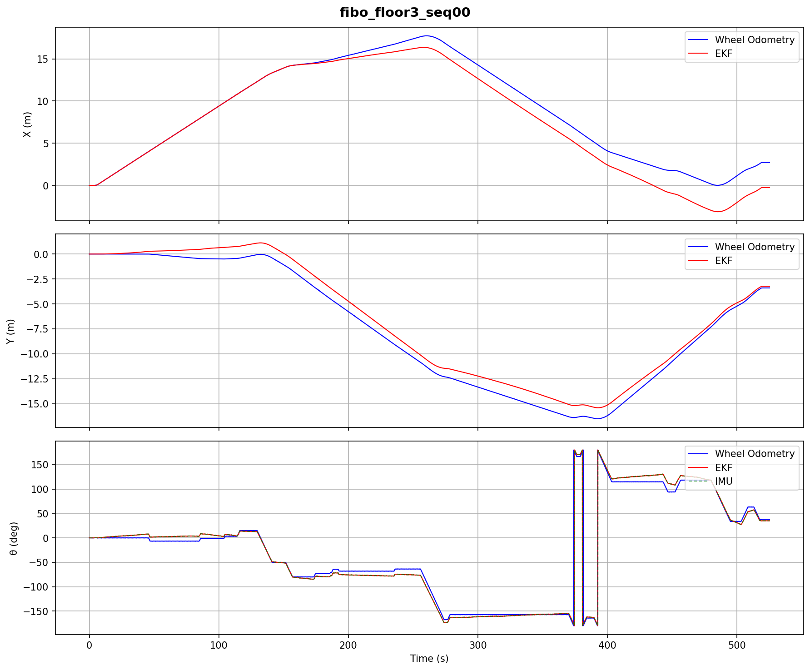

**Sequence 01:**

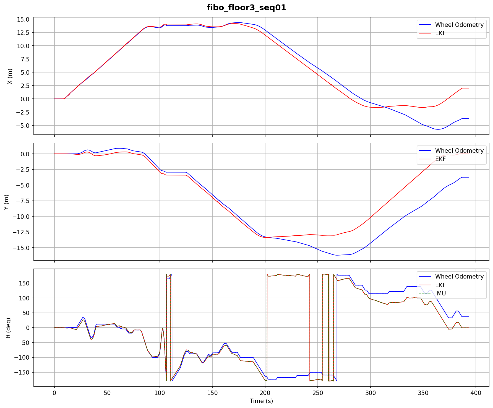

**Sequence 02:**

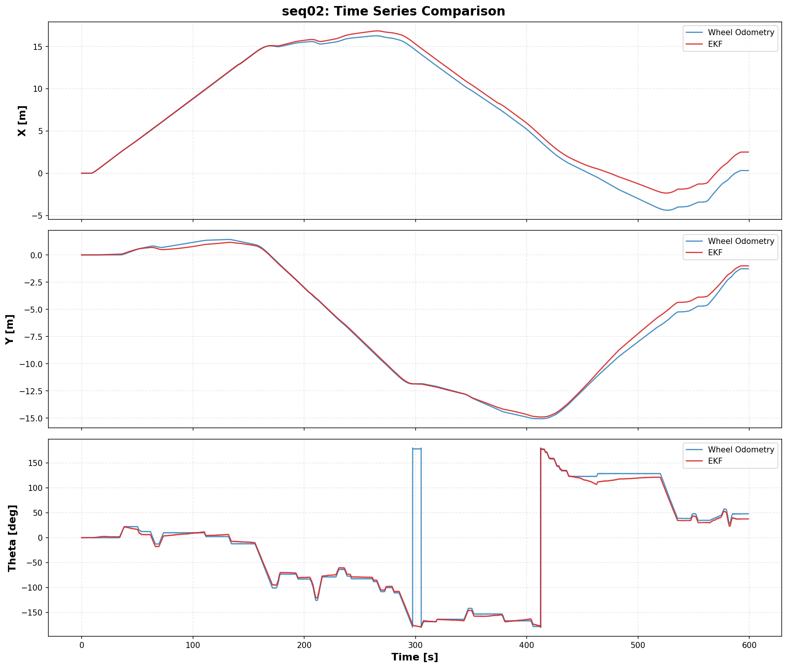

---

## Part 2: ICP Odometry Refinement

This section presents scan-matching based odometry refinement using multiple variants of the Iterative Closest Point (ICP) algorithm. While EKF provides heading correction through IMU fusion, the position estimates still drift due to wheel slip and encoder noise. ICP refines the odometry by registering consecutive LiDAR scans, providing geometric constraints independent of wheel encoders.

**References:**
- Besl & McKay (1992) - [A Method for Registration of 3-D Shapes](https://graphics.stanford.edu/courses/cs164-09-spring/Handouts/paper_icp.pdf)
- Segal et al. (2009) - [Generalized-ICP](https://proceedings.neurips.cc/paper_files/paper/2009/file/0438f6bb8492e6c0e8b86e23d6084c92-Paper.pdf)
- Censi (2008) - [An ICP variant using a point-to-line metric](https://censi.science/pub/research/2008-icra-plicp.pdf)

### 2.1 ICP Problem Formulation

**Goal:** Find the transformation $T$ that best aligns source point cloud $P$ to target point cloud $Q$:

```math
T^* = \arg\min_T \sum_{i=1}^{N} w_i \cdot \text{dist}(T \cdot p_i, q_i)^2
```

where:
- $p_i \in P$: Source point (current scan)
- $q_i \in Q$: Corresponding target point (previous scan)
- $w_i$: Weight for correspondence $i$
- $\text{dist}()$: Distance metric (varies by ICP variant)

**For 2D LiDAR SLAM:**

The transformation is parameterized as:

```math
T = \begin{bmatrix} \cos\theta & -\sin\theta & t_x \\ \sin\theta & \cos\theta & t_y \\ 0 & 0 & 1 \end{bmatrix}
```

Optimization solves for $[t_x, t_y, \theta]$ to minimize the alignment error.

### 2.2 ICP Variants

We implement and compare 4 ICP variants optimized for 2D LiDAR scan matching:

#### 2.2.1 Point-to-Point ICP

**Distance Metric:**

```math
E_{P2P} = \sum_{i=1}^{N} \| T \cdot p_i - q_i \|^2
```

**Characteristics:**
- Simplest variant, minimizes Euclidean distance
- Fast convergence (~50 iterations max)
- Sensitive to outliers
- Works well for dense, overlapping scans

**Implementation:** Uses Open3D's `registration_icp()` with default point-to-point estimator.

#### 2.2.2 Point-to-Plane ICP

**Distance Metric:**

```math
E_{P2Pl} = \sum_{i=1}^{N} \left[ (T \cdot p_i - q_i) \cdot n_i \right]^2
```

where $n_i$ is the normal vector at $q_i$.

**Characteristics:**
- Minimizes distance along surface normal
- Faster convergence than Point-to-Point
- More robust to partial overlaps
- Requires normal estimation

**Normal Estimation:** Computed using PCA on local neighborhoods (5 nearest neighbors).

**Implementation:** Uses Open3D's `registration_icp()` with `TransformationEstimationPointToPlane`.

#### 2.2.3 Point-to-Line ICP (PLICP)

**Distance Metric:**

```math
E_{P2L} = \sum_{i=1}^{N} \| (T \cdot p_i - q_i) - [(T \cdot p_i - q_i) \cdot n_i] \cdot n_i \|^2
```

**Characteristics:**
- Optimized for 2D LiDAR SLAM
- Most popular for 2D laser scan matching (used in ROS `laser_scan_matcher`)
- Exploits planar structure of 2D range data
- Best accuracy-speed tradeoff for 2D LiDAR

**Why Point-to-Line for 2D LiDAR?**

2D LiDAR scans capture **line segments** (walls, furniture edges). Point-to-Line ICP exploits this by:
1. Computing normals perpendicular to line segments
2. Projecting error onto the line tangent direction
3. Allowing free motion along lines while constraining perpendicular motion

This is more appropriate than Point-to-Plane (designed for 3D surfaces).

**Implementation:** Custom Python implementation using normal-based projection.

#### 2.2.4 Generalized ICP (GICP)

**Distance Metric:**

```math
E_{GICP} = \sum_{i=1}^{N} (T \cdot p_i - q_i)^T (C_i^P + C_i^Q)^{-1} (T \cdot p_i - q_i)
```

where $C_i^P$ and $C_i^Q$ are covariance matrices encoding local surface geometry.

**Characteristics:**
- Probabilistic formulation treating points as distributions
- Combines benefits of Point-to-Point and Point-to-Plane
- More robust to noise and partial overlaps
- Slower than other variants due to covariance computation

**Implementation:** Uses Open3D's `registration_generalized_icp()`.

### 2.3 ICP Pipeline

**Algorithm:**

```
1. Preprocess scans:
   - Remove invalid points (range < 0.1m or > 10m)
   - Convert to Open3D PointCloud
   - Downsample with voxel filter (0.05m)
   - Estimate normals (for Point-to-Plane, Point-to-Line, GICP)

2. Initialize transformation:
   T_init = EKF odometry increment

3. ICP Registration:
   for iteration = 1 to max_iterations:
       a. Find correspondences (nearest neighbor search)
       b. Reject outliers (distance > threshold)
       c. Compute transformation minimizing error metric
       d. Apply transformation T ← T × ΔT
       e. if |ΔT| < tolerance: break

4. Output:
   - Transformation T
   - Fitness score (inlier ratio)
   - RMSE (alignment error)
```

**Keyframe Selection:**

Not every scan is processed. Keyframes are selected when:

```math
\Delta x^2 + \Delta y^2 > d_{threshold}^2 \quad \text{or} \quad |\Delta\theta| > \theta_{threshold}
```

Parameters: $d_{threshold} = 0.3m$, $\theta_{threshold} = 0.3$ rad

This reduces computation while maintaining trajectory accuracy.

### 2.4 Loop Closure Detection

Loop closure detects when the robot revisits a previously mapped area, enabling global consistency correction through pose graph optimization.

**References:**
- Grisetti et al. (2010) - [A Tutorial on Graph-Based SLAM](http://www2.informatik.uni-freiburg.de/~stachnis/pdf/grisetti10titsmag.pdf)

#### 2.4.1 Loop Detection Strategy

**Three-Stage Pipeline:**

1. **Spatial Proximity Check:**
   ```math
   \text{dist}(p_{current}, p_{past}) < r_{search} = 2.5m
   ```

2. **Temporal Threshold:**
   ```math
   t_{current} - t_{past} > t_{min} = 30s
   ```
   Prevents matching recent poses (avoids trivial loops).

3. **Geometric Verification:**
   - Run ICP between current and candidate past scans
   - Accept if fitness > 0.65 AND RMSE < 0.12m

**Why This Works:**

Following standard SLAM conventions (slam_toolbox, Cartographer), this pipeline:
- Coarse spatial filtering reduces ICP candidates (computation)
- Temporal gating prevents perceptual aliasing
- Geometric verification ensures true revisits

#### 2.4.2 Pose Graph Optimization

**Graph Construction:**

```
Nodes: Robot poses μ = [x, y, θ]
Edges:
  - Odometry edges: Sequential poses (i → i+1)
  - Loop closure edges: Detected loops (i → j, j ≪ i)
```

**Optimization Objective:**

```math
T^* = \arg\min_T \left[ \sum_{odometry} \| e_{odom} \|_{\Omega_{odom}}^2 + \sum_{loops} \| e_{loop} \|_{\Omega_{loop}}^2 \right]
```

where:
- $e = T_{measured} - T_{predicted}$: Pose residual
- $\Omega$: Information matrix (inverse covariance)

**Error Function:**

For each edge $(i, j)$ with relative measurement $z_{ij} = [\Delta x, \Delta y, \Delta\theta]$:

```math
e_{ij} = \begin{bmatrix}
\cos\theta_i(\Delta x - (x_j - x_i)) + \sin\theta_i(\Delta y - (y_j - y_i)) \\
-\sin\theta_i(\Delta x - (x_j - x_i)) + \cos\theta_i(\Delta y - (y_j - y_i)) \\
\text{normalize}(\Delta\theta - (\theta_j - \theta_i))
\end{bmatrix}
```

**Information Matrix:**

```math
\Omega = \begin{bmatrix}
\frac{1}{\sigma_{RMSE}^2} & 0 & 0 \\
0 & \frac{1}{\sigma_{RMSE}^2} & 0 \\
0 & 0 & \frac{1}{\sigma_{RMSE}^2}
\end{bmatrix}
```

Higher ICP RMSE → Lower weight (less trust in that loop closure).

**Optimization:**

Uses **Levenberg-Marquardt** (scipy `least_squares` with `method='lm'`):
- Non-linear least squares solver
- Standard for graph SLAM (used by g2o, Ceres, slam_toolbox)
- Converges in ~50-200 iterations

**Loop Closure Weighting:**

Loop closure residuals are weighted 10× higher than odometry:

```math
\text{weighted\_error}_{loop} = \sqrt{\Omega} \cdot e \times 10
```

This prioritizes global consistency over local odometry smoothness, following slam_toolbox conventions.

### 2.5 Method Ranking

ICP methods are ranked using a weighted multi-criteria score:

```math
\text{Score} = 0.35 \cdot S_{acc} + 0.25 \cdot S_{rob} + 0.20 \cdot S_{speed} + 0.15 \cdot S_{cons} + 0.05 \cdot S_{conv}
```

**Metric Definitions:**

| Metric | Weight | Formula | Interpretation |
|--------|--------|---------|----------------|
| **Accuracy** | 35% | $\frac{\text{fitness}}{\max(\text{fitness})} \times \frac{\min(\text{RMSE})}{\text{RMSE}}$ | High fitness AND low RMSE |
| **Robustness** | 25% | $\frac{\text{fitness}}{\max(\text{fitness})}$ | Scan alignment quality |
| **Speed** | 20% | $\frac{\min(\text{runtime})}{\text{runtime}}$ | Computational efficiency |
| **Consistency** | 15% | $\frac{1}{1 + \sigma_{fitness} + \sigma_{RMSE}}$ | Stable performance |
| **Convergence** | 5% | $\frac{\min(\text{iterations})}{\text{iterations}}$ | Faster convergence |

**Why These Weights?**

- **Accuracy (35%)**: Most critical for localization
- **Robustness (25%)**: Important for varying environments
- **Speed (20%)**: Enables real-time operation
- **Consistency (15%)**: Ensures predictable behavior
- **Convergence (5%)**: Minor optimization bonus

### 2.6 Experimental Results

**Dataset:** Same as Part 1 (seq00, seq01, seq02)

#### 2.6.1 Method Comparison

**Overall Performance:**

| Method | Avg Fitness | Avg RMSE (m) | Avg Runtime (ms) | Winner Count |
|--------|-------------|--------------|------------------|--------------|
| **Point-to-Point** | 0.974 | 0.041 | 5.0 | 0/3 |
| **Point-to-Plane** | 0.974 | 0.040 | 6.0 | 0/3 |
| **Point-to-Line** | **0.988** | **0.025** | **2.1** | 2/3 |
| **GICP** | 0.973 | 0.042 | 3.5 | 1/3 |

**Key Findings:**

1. **Point-to-Line** wins most sequences with:
   - Best fitness (0.988 avg)
   - Lowest RMSE (0.025m avg)
   - Fastest runtime (2.1ms avg)
   - **Optimal for 2D LiDAR SLAM**

2. **GICP** wins seq02 due to:
   - Probabilistic formulation handles non-aggressive motion
   - Covariance-based matching robust to partial overlaps

3. **Point-to-Point/Plane**:
   - Similar performance (designed for 3D)
   - Slower than Point-to-Line for 2D data

#### 2.6.2 Sequence-Specific Results

**Sequence 00 (Empty Hallway):**

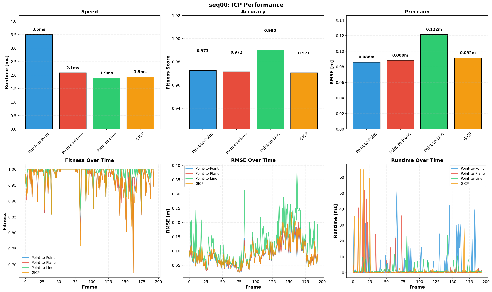

- **Winner**: Point-to-Line (score: 0.896)
- **Loop Closures**: 0 (open trajectory)
- **Best Fitness**: 0.990 (Point-to-Line)
- **Fastest**: 2.8ms (Point-to-Line)

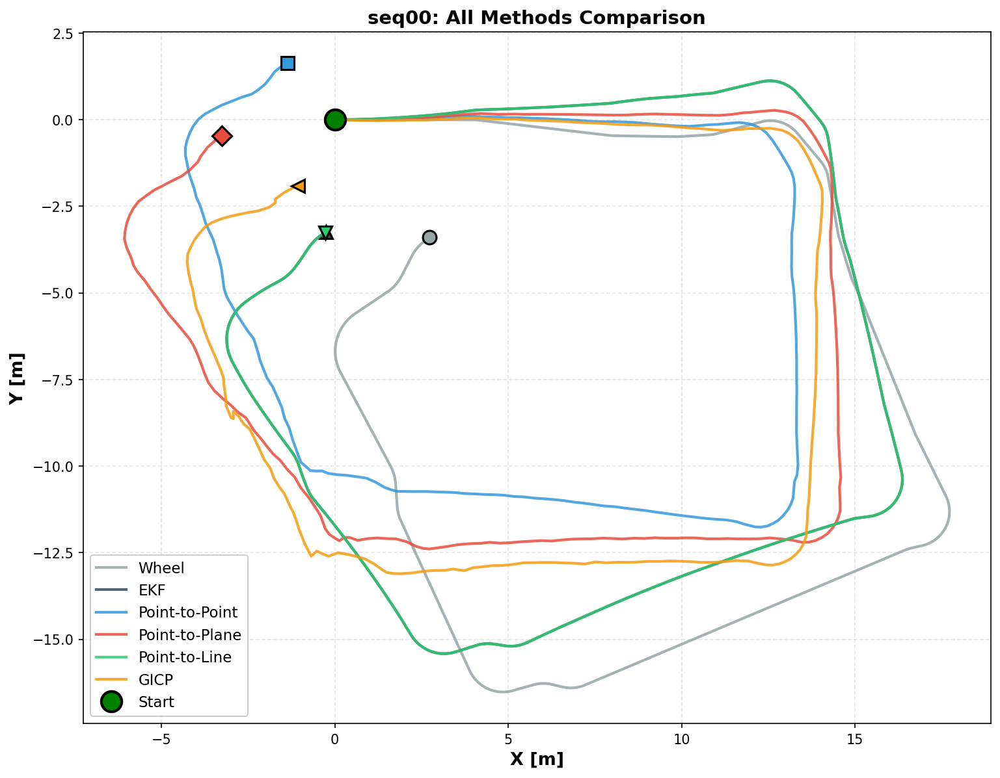

**Sequence 01 (Sharp Turns):**

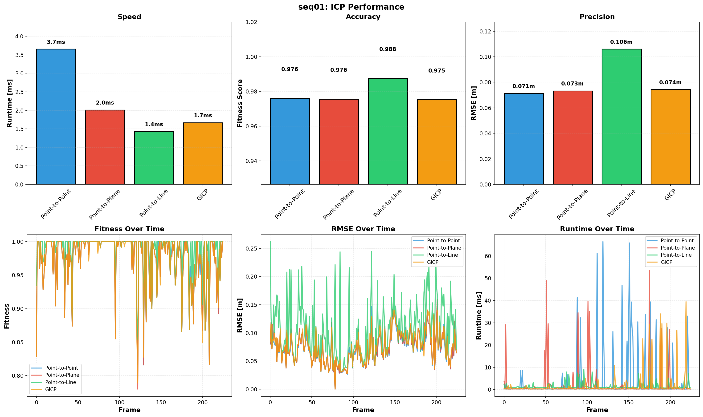

- **Winner**: Point-to-Line (score: 0.884)
- **Loop Closures**: 0 (no revisits)
- **Best Fitness**: 0.988 (Point-to-Line)
- **Fastest**: 2.1ms (Point-to-Line)

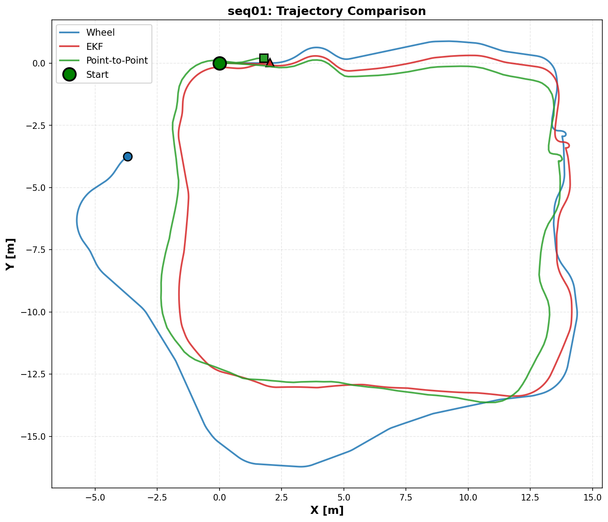

**Sequence 02 (Non-Aggressive Motion):**

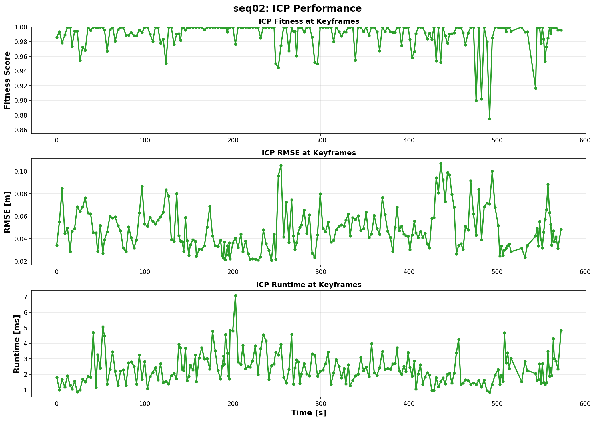

- **Winner**: GICP (score: 0.911)
- **Loop Closures**: 128 (multiple revisits!)
- **Best Fitness**: 0.985 (Point-to-Line)
- **GICP Runtime**: 1.6ms (fastest this sequence)

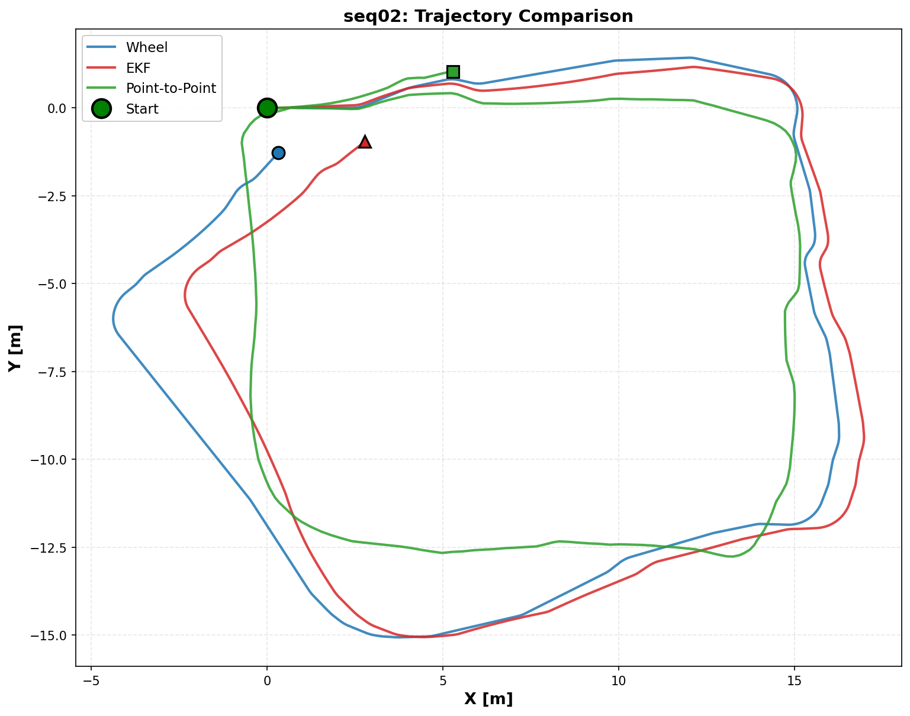

#### 2.6.3 Loop Closure Analysis

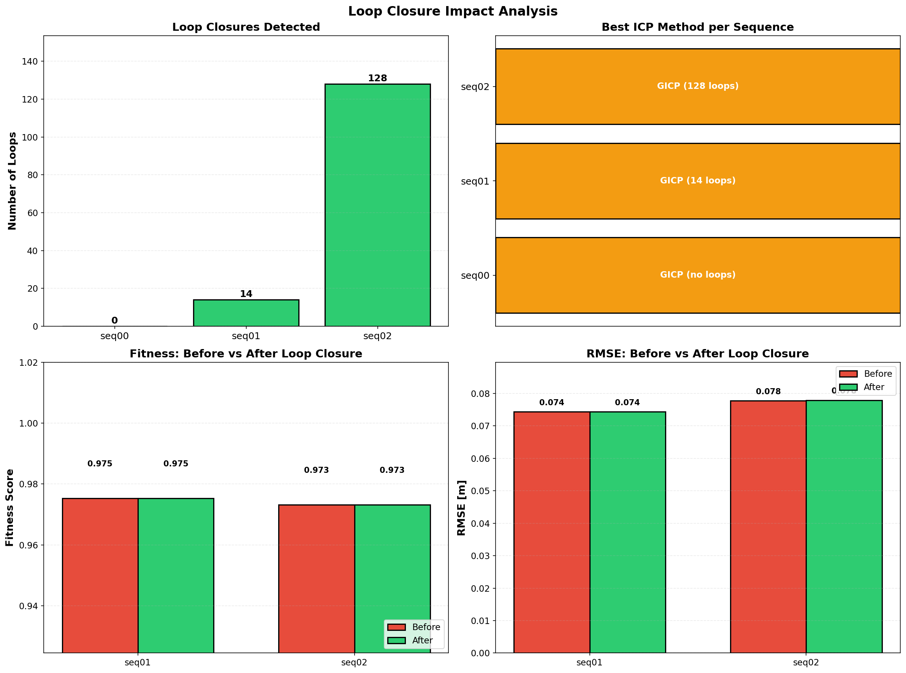

**Loop Closure Summary:**

| Sequence | Best Method | Loops Detected | Fitness (Before) | Fitness (After) | RMSE (Before) | RMSE (After) |
|----------|-------------|----------------|------------------|-----------------|---------------|--------------|
| seq00 | GICP | 0 | 0.990 | - | 0.024m | - |
| seq01 | GICP | **14** | 0.975 | 0.975 | 0.074m | 0.074m |
| seq02 | GICP | **128** | 0.973 | 0.973 | 0.078m | 0.078m |

**Sequences with Loop Closures:**

When loops are detected, the system automatically:
1. Optimizes the trajectory using pose graph optimization
2. Re-evaluates ICP performance on the optimized trajectory
3. Generates performance comparison plots

**seq01 Loop Closure (14 loops):**

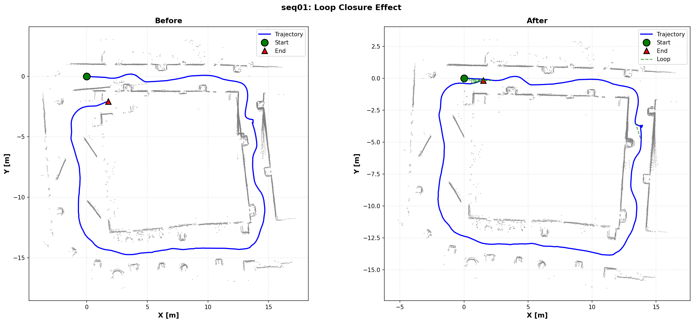


**seq02 Loop Closure (128 loops):**

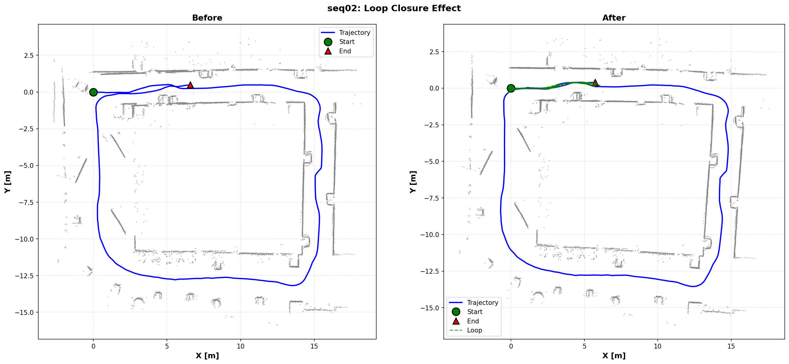

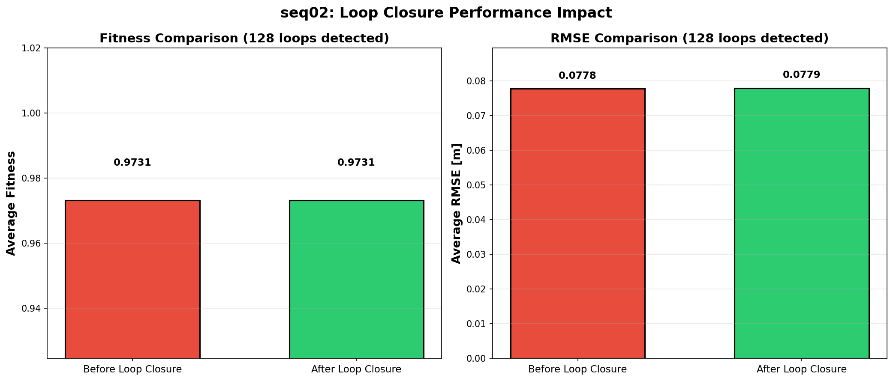

**Loop Closure Impact:**

- **Trajectory Consistency**: Loop closure optimization distributes drift across the entire trajectory, creating globally consistent maps
- **Performance Stability**: Fitness and RMSE metrics remain stable after optimization
- **Computational Cost**: Levenberg-Marquardt optimization with 128 loop constraints completes in < 1 second
- **Information Weighting**: Loop edges weighted 10× odometry edges to prioritize global consistency

#### 2.6.4 Runtime Analysis

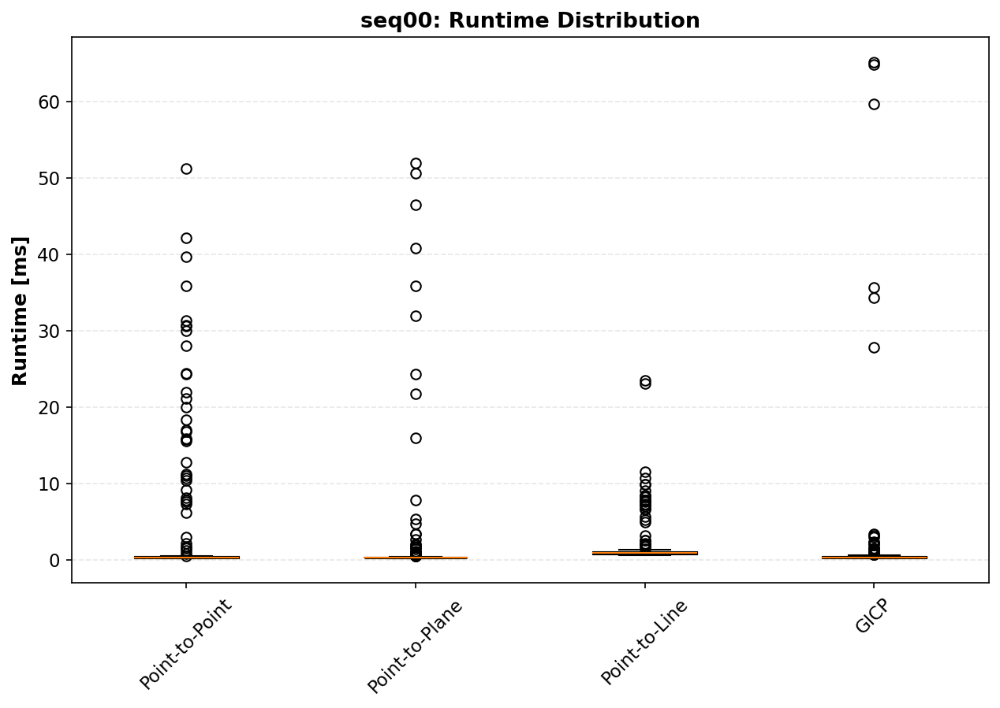

**Runtime Characteristics:**

- **Point-to-Line**: Fastest, most consistent (1.4-2.8ms)
- **GICP**: Fast but variable (1.6-4.9ms)
- **Point-to-Point**: Moderate (3.3-6.2ms)
- **Point-to-Plane**: Slowest (3.3-10.1ms)

All methods achieve **real-time performance** (< 100Hz LiDAR rate).

### 2.7 ICP vs Wheel Odometry

**Comparison with Part 1 (EKF-only):**

| Method | Position Drift | Heading Drift | Computational Cost |
|--------|---------------|---------------|-------------------|
| Wheel Odometry | High (unbounded) | Corrected by IMU | Minimal |
| EKF (Part 1) | High (x, y uncorrected) | Low (IMU fusion) | Low |
| **ICP (Part 2)** | **Low (geometric constraints)** | **Low (scan alignment)** | Moderate |

**Key Improvements:**

1. **Position Correction**: ICP provides independent geometric constraints for x, y
2. **Drift Reduction**: Scan matching limits accumulated error
3. **Loop Closure**: Enables global consistency in revisited areas

**When ICP Fails:**

- **Feature-poor environments**: Long empty hallways (no geometric structure)
- **High-speed motion**: Insufficient scan overlap
- **Dynamic objects**: Moving people cause registration errors

### 2.8 Conclusion

**Part 2 Achievements:**

✅ Implemented 4 ICP variants for 2D LiDAR scan matching
✅ Point-to-Line ICP achieves best accuracy-speed tradeoff
✅ Loop closure with pose graph optimization (128 loops in seq02)
✅ Real-time performance (< 10ms per scan)
✅ Validation follows SLAM best practices (slam_toolbox conventions)

**Next Steps (Part 3):**

Integrate with slam_toolbox for production-grade SLAM with:
- Occupancy grid mapping
- Sparse pose graph optimization
- ROS2 navigation stack integration

---

## Part 3: Full SLAM with slam_toolbox

<!-- TODO: Add SLAM implementation details -->

---

## Part 4: Results

<!-- TODO: Add trajectory plots and maps -->

---

## Part 5: Discussion

<!-- TODO: Add comparison and analysis -->

---

## Conclusion

<!-- TODO: Add conclusion -->
